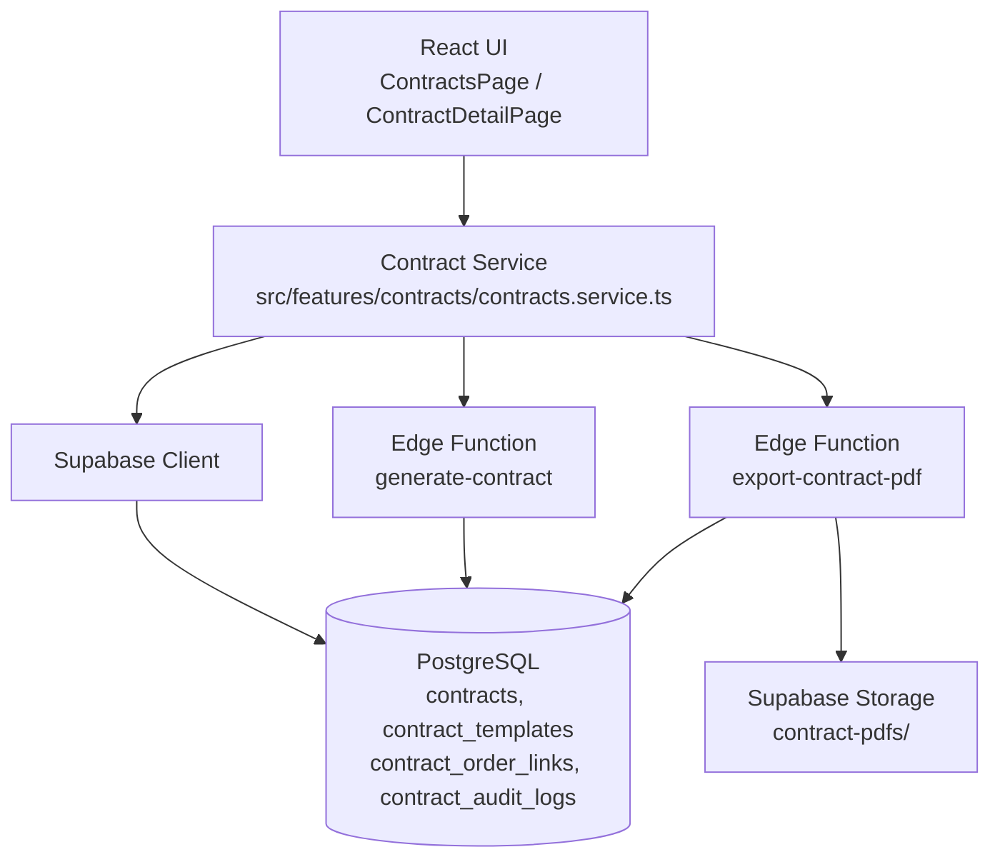
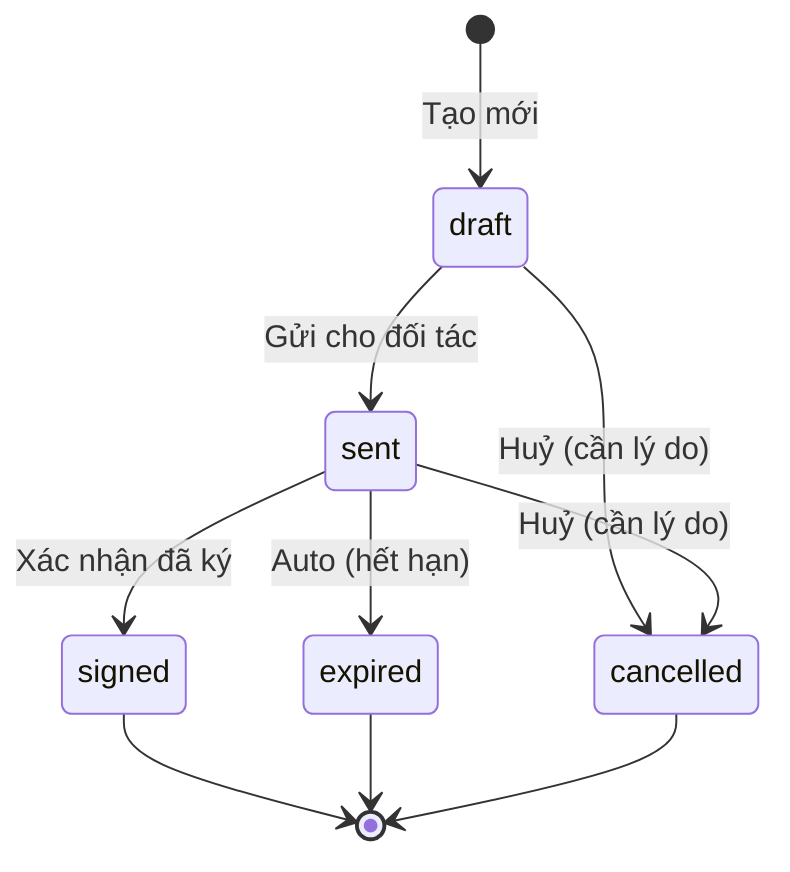

# Tài Liệu Thiết Kế: Tự Động Tạo Hợp Đồng (Auto Contract Generation)

## Tổng Quan

Module Auto Contract Generation cho phép hệ thống ERP dệt may Vĩnh Phát tự động sinh hợp đồng mua bán vải từ dữ liệu đơn hàng, khách hàng hoặc nhà cung cấp đã có trong hệ thống. Module giảm thiểu nhập liệu thủ công, đảm bảo tính nhất quán pháp lý và hỗ trợ xuất PDF theo chuẩn công ty.

Hợp đồng tuân theo mẫu "Hợp Đồng Nguyên Tắc Mua Bán Vải" của Vĩnh Phát, với số hợp đồng tự động theo định dạng `{seq:03d}/{năm}/HĐNT–{loại}/TKS`.

### Phạm vi

- Tạo hợp đồng từ Order hoặc từ Customer/Supplier trực tiếp
- Quản lý mẫu hợp đồng (Contract Template) với placeholder động
- Xem trước, chỉnh sửa và quản lý vòng đời hợp đồng
- Xuất PDF theo chuẩn A4 của công ty
- Đánh số hợp đồng tự động, không trùng lặp, an toàn concurrent
- Liên kết hợp đồng với đơn hàng

---

## Kiến Trúc

Module tuân theo kiến trúc feature-based của dự án (React + TypeScript + Supabase). Logic nghiệp vụ phức tạp (đánh số, xuất PDF) được đặt trong Supabase Edge Functions để đảm bảo tính nhất quán và bảo mật.



### Nguyên tắc thiết kế

1. **Immutability của hợp đồng đã ký**: Contract ở trạng thái `signed` không được phép chỉnh sửa nội dung.
2. **Template snapshot**: Khi tạo Contract, nội dung template được snapshot vào Contract — thay đổi template sau không ảnh hưởng Contract cũ.
3. **Atomic contract number**: Đánh số hợp đồng dùng PostgreSQL sequence để tránh race condition.
4. **PDF generation tách biệt**: Xuất PDF là tác vụ độc lập, không ảnh hưởng trạng thái Contract nếu thất bại.
5. **Audit trail đầy đủ**: Mọi thay đổi nội dung và trạng thái đều được ghi log.

---

## Thành Phần Và Giao Diện

### Frontend Components

```
src/features/contracts/
├── ContractsPage.tsx          # Danh sách hợp đồng + bộ lọc
├── ContractDetailPage.tsx     # Chi tiết + xem trước + actions
├── ContractForm.tsx           # Form tạo/chỉnh sửa hợp đồng
├── ContractPreview.tsx        # Preview nội dung hợp đồng
├── ContractStatusBadge.tsx    # Badge trạng thái
├── contracts.module.ts        # Zod schemas + types
└── contracts.service.ts       # API calls + business logic
```

```
src/features/contract-templates/
├── ContractTemplatesPage.tsx  # Quản lý template (admin only)
├── TemplateEditor.tsx         # Editor điều khoản template
└── contract-templates.module.ts
```

### Supabase Edge Functions

| Function              | Mục đích                                                            |
| --------------------- | ------------------------------------------------------------------- |
| `generate-contract`   | Tạo Contract từ Order/Customer/Supplier, đánh số, snapshot template |
| `export-contract-pdf` | Render HTML → PDF, upload Storage, cập nhật pdf_url                 |

### Điểm tích hợp với module khác

| Module    | Cách tích hợp                                                                  |
| --------- | ------------------------------------------------------------------------------ |
| Orders    | Nút "Tạo hợp đồng" trên OrderDetailPage; hiển thị danh sách contracts liên kết |
| Customers | Nút "Tạo hợp đồng" trên CustomerDetailPage                                     |
| Suppliers | Nút "Tạo hợp đồng" trên SupplierDetailPage                                     |
| Settings  | Đọc company info cho Party_B; đọc contract prefix                              |

---

## Mô Hình Dữ Liệu

### Bảng `contract_templates`

```sql
CREATE TABLE contract_templates (
  id            uuid PRIMARY KEY DEFAULT gen_random_uuid(),
  type          text NOT NULL CHECK (type IN ('sale', 'purchase')),
  name          text NOT NULL,
  content       text NOT NULL,  -- HTML với {{placeholder}}
  is_active     boolean NOT NULL DEFAULT true,
  created_at    timestamptz NOT NULL DEFAULT now(),
  updated_at    timestamptz NOT NULL DEFAULT now(),
  created_by    uuid REFERENCES profiles(id)
);
```

Placeholder chuẩn trong template:

| Placeholder                  | Dữ liệu                  |
| ---------------------------- | ------------------------ |
| `{{contract_number}}`        | Số hợp đồng              |
| `{{contract_date}}`          | Ngày ký                  |
| `{{party_a_name}}`           | Tên bên A                |
| `{{party_a_address}}`        | Địa chỉ bên A            |
| `{{party_a_tax_code}}`       | MST bên A                |
| `{{party_a_representative}}` | Người đại diện bên A     |
| `{{party_a_title}}`          | Chức vụ đại diện bên A   |
| `{{party_b_name}}`           | Tên công ty Vĩnh Phát    |
| `{{party_b_address}}`        | Địa chỉ Vĩnh Phát        |
| `{{party_b_tax_code}}`       | MST Vĩnh Phát            |
| `{{party_b_bank_account}}`   | Tài khoản ngân hàng      |
| `{{party_b_representative}}` | Người đại diện Vĩnh Phát |
| `{{payment_term}}`           | Điều khoản thanh toán    |
| `{{effective_date}}`         | Ngày hiệu lực            |
| `{{expiry_date}}`            | Ngày hết hạn             |

### Bảng `contracts`

```sql
CREATE TABLE contracts (
  id                uuid PRIMARY KEY DEFAULT gen_random_uuid(),
  contract_number   text NOT NULL UNIQUE,
  type              text NOT NULL CHECK (type IN ('sale', 'purchase')),
  status            text NOT NULL DEFAULT 'draft'
                    CHECK (status IN ('draft', 'sent', 'signed', 'expired', 'cancelled')),

  -- Snapshot nội dung tại thời điểm tạo
  content           text NOT NULL,  -- HTML đã render (không còn placeholder)
  template_id       uuid REFERENCES contract_templates(id),

  -- Party A (customer hoặc supplier)
  party_a_type      text NOT NULL CHECK (party_a_type IN ('customer', 'supplier')),
  party_a_id        uuid NOT NULL,  -- FK logic (customer_id hoặc supplier_id)
  party_a_name      text NOT NULL,
  party_a_address   text,
  party_a_tax_code  text,
  party_a_representative text,
  party_a_title     text,

  -- Party B (công ty Vĩnh Phát — snapshot từ settings)
  party_b_name      text NOT NULL,
  party_b_address   text,
  party_b_tax_code  text,
  party_b_bank_account text,
  party_b_representative text,

  -- Điều khoản
  payment_term      text,
  effective_date    date,
  expiry_date       date,
  notes             text,

  -- Nguồn tạo
  source_order_id   uuid REFERENCES orders(id),  -- null nếu tạo từ customer/supplier

  -- PDF
  pdf_url           text,
  pdf_generated_at  timestamptz,

  -- Trạng thái lifecycle
  sent_at           timestamptz,
  sent_by           uuid REFERENCES profiles(id),
  signed_at         timestamptz,
  signed_by         uuid REFERENCES profiles(id),
  signed_file_url   text,  -- file hợp đồng đã ký scan
  cancelled_at      timestamptz,
  cancelled_by      uuid REFERENCES profiles(id),
  cancel_reason     text,

  -- Metadata
  created_at        timestamptz NOT NULL DEFAULT now(),
  updated_at        timestamptz NOT NULL DEFAULT now(),
  created_by        uuid REFERENCES profiles(id)
);
```

### Bảng `contract_order_links`

```sql
CREATE TABLE contract_order_links (
  id           uuid PRIMARY KEY DEFAULT gen_random_uuid(),
  contract_id  uuid NOT NULL REFERENCES contracts(id) ON DELETE CASCADE,
  order_id     uuid NOT NULL REFERENCES orders(id) ON DELETE CASCADE,
  linked_at    timestamptz NOT NULL DEFAULT now(),
  linked_by    uuid REFERENCES profiles(id),
  UNIQUE (contract_id, order_id)
);
```

### Bảng `contract_audit_logs`

```sql
CREATE TABLE contract_audit_logs (
  id           uuid PRIMARY KEY DEFAULT gen_random_uuid(),
  contract_id  uuid NOT NULL REFERENCES contracts(id) ON DELETE CASCADE,
  action       text NOT NULL,  -- 'created', 'updated', 'status_changed', 'pdf_exported'
  old_values   jsonb,
  new_values   jsonb,
  performed_by uuid REFERENCES profiles(id),
  performed_at timestamptz NOT NULL DEFAULT now()
);
```

### PostgreSQL Sequence cho đánh số

```sql
-- Sequence riêng cho từng năm, reset bằng cron job hoặc logic trong Edge Function
CREATE SEQUENCE contract_seq_sale_2026 START 1;
CREATE SEQUENCE contract_seq_purchase_2026 START 1;
```

Thực tế sẽ dùng approach: lấy `MAX(seq)` trong năm hiện tại với `SELECT ... FOR UPDATE` để đảm bảo atomic.

### Bổ sung vào bảng `settings`

Thêm các key sau vào bảng `settings` hiện có:

| Key                            | Giá trị mẫu                 | Mô tả                          |
| ------------------------------ | --------------------------- | ------------------------------ |
| `contract_sale_prefix`         | `ĐKKH`                      | Tiền tố loại hợp đồng bán hàng |
| `contract_purchase_prefix`     | `ĐKNH`                      | Tiền tố loại hợp đồng mua hàng |
| `company_representative`       | `VŨ TIẾN LỰC`               | Người đại diện ký hợp đồng     |
| `company_representative_title` | `Giám Đốc`                  | Chức vụ người đại diện         |
| `company_bank_account`         | `80000346931`               | Số tài khoản ngân hàng         |
| `company_bank_name`            | `Vietcombank – CN Tân Định` | Tên ngân hàng                  |

---

## Thuộc Tính Đúng Đắn (Correctness Properties)

_Một thuộc tính (property) là đặc điểm hoặc hành vi phải đúng trong mọi lần thực thi hợp lệ của hệ thống — về cơ bản là một phát biểu hình thức về những gì hệ thống phải làm. Các thuộc tính là cầu nối giữa đặc tả dạng ngôn ngữ tự nhiên và đảm bảo đúng đắn có thể kiểm chứng tự động._

### Property 1: Party_A luôn khớp với nguồn dữ liệu

_Với bất kỳ_ Customer, Supplier hoặc Order hợp lệ nào được dùng để tạo Contract, các trường `party_a_name`, `party_a_tax_code`, `party_a_address`, `party_a_representative` trong Contract phải khớp chính xác với dữ liệu tương ứng trong nguồn.

**Validates: Requirements 1.1, 2.1, 2.2**

### Property 2: Party_B luôn là thông tin công ty từ settings

_Với bất kỳ_ Contract nào được tạo, các trường Party_B (`party_b_name`, `party_b_tax_code`, `party_b_bank_account`, `party_b_representative`) phải khớp với giá trị trong bảng `settings` tại thời điểm tạo Contract.

**Validates: Requirements 1.2, 3.5**

### Property 3: Contract mới tạo luôn có trạng thái draft

_Với bất kỳ_ đầu vào hợp lệ nào (Order, Customer, hoặc Supplier), Contract được tạo ra phải có `status = 'draft'`.

**Validates: Requirements 4.1**

### Property 4: Contract_Number luôn đúng định dạng và duy nhất

_Với bất kỳ_ tập hợp Contracts nào trong hệ thống, mỗi `contract_number` phải: (a) match pattern `\d{3}/\d{4}/HĐNT–\w+/TKS`, (b) là duy nhất trong toàn bộ bảng `contracts`.

**Validates: Requirements 1.4, 7.1, 7.2**

### Property 5: Từ chối tạo Contract từ nguồn không hợp lệ

_Với bất kỳ_ Order có `status = 'cancelled'`, hoặc Customer/Supplier có `status = 'inactive'`, hàm `generateContract()` phải trả về lỗi và không tạo bất kỳ bản ghi nào trong bảng `contracts`.

**Validates: Requirements 1.6, 1.7, 2.5**

### Property 6: Template placeholder được render đầy đủ

_Với bất kỳ_ Contract_Template có chứa placeholder `{{field_name}}` nào, sau khi render với dữ liệu hợp lệ, nội dung `content` của Contract không được chứa bất kỳ chuỗi `{{...}}` nào còn sót lại.

**Validates: Requirements 3.4**

### Property 7: Thay đổi template không ảnh hưởng Contract cũ

_Với bất kỳ_ Contract đã tạo nào, sau khi Admin cập nhật Contract_Template, nội dung `content` của Contract đó phải giữ nguyên không thay đổi.

**Validates: Requirements 3.3**

### Property 8: Quyền chỉnh sửa theo trạng thái

_Với bất kỳ_ Contract có `status = 'draft'` hoặc `status = 'sent'`, thao tác chỉnh sửa nội dung phải thành công. _Với bất kỳ_ Contract có `status = 'signed'`, thao tác chỉnh sửa nội dung phải bị từ chối.

**Validates: Requirements 4.2, 4.3**

### Property 9: Mọi thay đổi nội dung đều có audit log

_Với bất kỳ_ thao tác chỉnh sửa nội dung Contract nào thành công, bảng `contract_audit_logs` phải có ít nhất một entry mới với đúng `contract_id`, `performed_by`, và `performed_at` trong khoảng thời gian thực hiện.

**Validates: Requirements 4.5**

### Property 10: PDF export không thay đổi trạng thái Contract khi thất bại

_Với bất kỳ_ Contract nào, nếu quá trình xuất PDF thất bại (bất kể lý do), `status` của Contract phải giữ nguyên giá trị trước khi gọi export.

**Validates: Requirements 5.5**

### Property 11: Vòng đời trạng thái hợp lệ

_Với bất kỳ_ chuỗi chuyển trạng thái hợp lệ nào (`draft→sent`, `sent→signed`, `draft→cancelled`, v.v.), hệ thống phải chấp nhận. _Với bất kỳ_ chuyển trạng thái không hợp lệ nào (`signed→draft`, `expired→sent`, v.v.), hệ thống phải từ chối.

**Validates: Requirements 6.1**

### Property 12: Transition sang sent/signed ghi nhận metadata

_Với bất kỳ_ Contract nào được chuyển sang `status = 'sent'`, trường `sent_at` và `sent_by` phải được ghi nhận. _Với bất kỳ_ Contract nào được chuyển sang `status = 'signed'`, trường `signed_at` và `signed_by` phải được ghi nhận.

**Validates: Requirements 6.2, 6.3**

### Property 13: Auto-expiry đúng điều kiện

_Với bất kỳ_ Contract nào có `expiry_date < CURRENT_DATE` và `status NOT IN ('signed', 'cancelled')`, sau khi chạy expiry job, `status` phải là `'expired'`.

**Validates: Requirements 6.4**

### Property 14: Huỷ hợp đồng yêu cầu lý do

_Với bất kỳ_ yêu cầu huỷ Contract nào không có `cancel_reason`, hệ thống phải từ chối. _Với bất kỳ_ yêu cầu huỷ có `cancel_reason` hợp lệ, `contract_audit_logs` phải có entry ghi nhận lý do huỷ.

**Validates: Requirements 6.5**

### Property 15: Liên kết Contract–Order bị chặn khi đã ký

_Với bất kỳ_ Contract có `status = 'signed'`, thao tác link hoặc unlink với Order phải bị từ chối. _Với bất kỳ_ Contract có `status != 'signed'`, thao tác link/unlink phải thành công.

**Validates: Requirements 8.4**

### Property 16: Contract không có Order để trống quy cách/số lượng

_Với bất kỳ_ Contract được tạo từ Customer hoặc Supplier (không có `source_order_id`), các trường quy cách, số lượng, đơn giá trong nội dung phải là trống hoặc ghi chú "Theo từng đơn đặt hàng".

**Validates: Requirements 2.4**

---

## Xử Lý Lỗi

### Lỗi validation khi tạo Contract

| Điều kiện                       | Thông báo lỗi                                                                             |
| ------------------------------- | ----------------------------------------------------------------------------------------- |
| Order có `status = 'cancelled'` | "Không thể tạo hợp đồng cho đơn hàng đã huỷ."                                             |
| Customer/Supplier `inactive`    | "Không thể tạo hợp đồng cho đối tác không còn hoạt động."                                 |
| Order đã có Contract liên kết   | "Đơn hàng này đã có hợp đồng. Bạn có muốn tạo hợp đồng mới không?" (cảnh báo, không chặn) |
| Template không tồn tại          | "Không tìm thấy mẫu hợp đồng phù hợp. Vui lòng liên hệ quản trị viên."                    |

### Lỗi xuất PDF

- PDF thất bại: trả về lỗi cụ thể, không thay đổi `status` Contract.
- Timeout (>10s): trả về lỗi timeout, cho phép thử lại.
- Storage upload thất bại: log lỗi, không cập nhật `pdf_url`.

### Lỗi chuyển trạng thái

| Transition không hợp lệ       | Thông báo                                                      |
| ----------------------------- | -------------------------------------------------------------- |
| Chỉnh sửa Contract `signed`   | "Hợp đồng đã ký không thể chỉnh sửa."                          |
| Huỷ không có lý do            | "Vui lòng nhập lý do huỷ hợp đồng."                            |
| Link/unlink Contract `signed` | "Không thể thay đổi liên kết đơn hàng sau khi hợp đồng đã ký." |

### State machine hợp lệ



---

## Chiến Lược Kiểm Thử

### Thư viện

- **Property-based testing**: [fast-check](https://github.com/dubzzz/fast-check) (TypeScript)
- **Unit testing**: Vitest
- **Integration testing**: Vitest + Supabase local

### Cấu hình property tests

Mỗi property test chạy tối thiểu **100 iterations**. Tag format:

```
// Feature: auto-contract-generation, Property {N}: {property_text}
```

### Unit tests (ví dụ cụ thể)

- Tạo Contract từ Order với đầy đủ dữ liệu → kiểm tra tất cả fields
- Tạo Contract từ Customer không có Order → kiểm tra `source_order_id = null`
- Admin edit template → Contract cũ không thay đổi
- Export PDF thành công → `pdf_url` được cập nhật
- Export PDF thất bại → `status` không thay đổi
- Filter danh sách Contract theo status/customer/date range

### Property tests (theo từng property)

```typescript
// Property 1: Party_A mapping
fc.assert(
  fc.property(
    fc.record({
      name: fc.string(),
      taxCode: fc.string(),
      address: fc.string(),
    }),
    (customer) => {
      const contract = generateContract({ customer });
      return (
        contract.partyAName === customer.name &&
        contract.partyATaxCode === customer.taxCode
      );
    },
  ),
  { numRuns: 100 },
);

// Property 4: Contract number format
fc.assert(
  fc.property(
    fc.integer({ min: 1, max: 999 }),
    fc.integer({ min: 2020, max: 2099 }),
    (seq, year) => {
      const num = formatContractNumber(seq, year, 'sale');
      return /^\d{3}\/\d{4}\/HĐNT–\w+\/TKS$/.test(num);
    },
  ),
  { numRuns: 100 },
);

// Property 5: Reject invalid sources
fc.assert(
  fc.property(fc.record({ status: fc.constant('cancelled') }), (order) => {
    const result = generateContract({ order });
    return result.error !== null && result.contract === null;
  }),
  { numRuns: 100 },
);

// Property 6: No remaining placeholders after render
fc.assert(
  fc.property(
    arbitraryTemplateWithPlaceholders(),
    arbitraryContractData(),
    (template, data) => {
      const rendered = renderTemplate(template.content, data);
      return !/\{\{[^}]+\}\}/.test(rendered);
    },
  ),
  { numRuns: 100 },
);
```

### Integration tests

- Concurrent contract creation (2+ simultaneous requests) → unique contract numbers
- Full lifecycle: draft → sent → signed → verify audit log entries
- PDF export end-to-end với Supabase Storage local

### Smoke tests

- Hệ thống có đủ 2 loại template (`sale`, `purchase`) trong database
- Settings có đủ company info keys cần thiết cho Party_B
