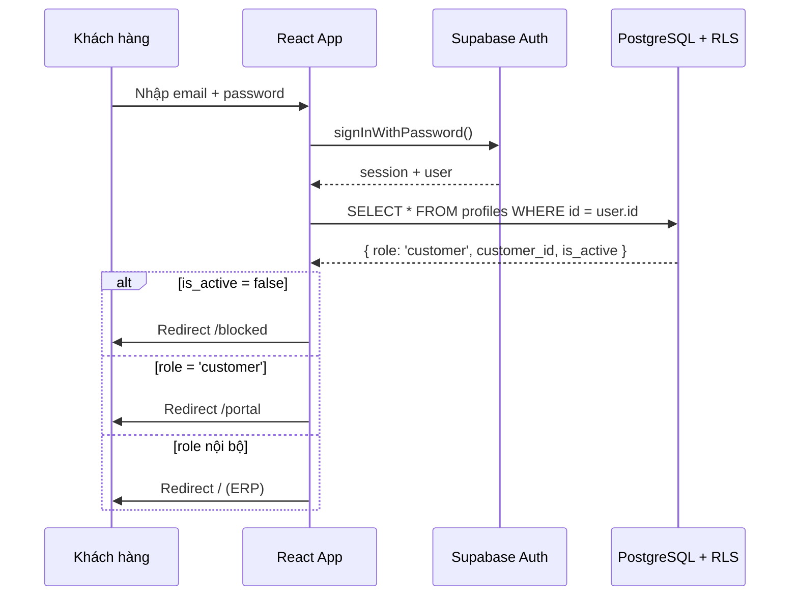

# Thiết Kế Kỹ Thuật: Customer Portal

## Overview

Customer Portal là một sub-application read-only dành cho khách hàng, chạy trên cùng React frontend nhưng tách biệt hoàn toàn về routing, layout và phân quyền so với giao diện ERP nội bộ.

Khách hàng đăng nhập bằng Supabase Auth với role `customer` (thêm mới vào enum `user_role`). Sau khi xác thực, họ chỉ thấy dữ liệu của chính mình nhờ RLS policies ở tầng database — không phụ thuộc vào logic frontend.

Toàn bộ portal là read-only ở giai đoạn đầu. Không có form tạo/sửa/xóa.

---

## Architecture

### Phân tách routing

```
/auth                    ← Login chung (ERP + Customer Portal)
/portal/*                ← Customer Portal (role: customer)
  /portal                → Dashboard tổng quan
  /portal/orders         → Danh sách đơn hàng
  /portal/orders/:id     → Chi tiết đơn hàng + tiến độ
  /portal/debt           → Công nợ tổng hợp
  /portal/payments       → Lịch sử thanh toán
  /portal/shipments      → Phiếu giao hàng
/*                       ← ERP nội bộ (role: admin/manager/staff/driver/viewer/sale)
```

Sau khi đăng nhập, `AuthProvider` đọc `profile.role`. Nếu role là `customer`, redirect về `/portal`. Nếu là role nội bộ, redirect về `/` (ERP dashboard).

### Luồng xác thực



### Cách ly dữ liệu qua RLS

Mọi query từ Customer Portal đều đi qua Supabase client với anon key. RLS tự động lọc theo `auth.uid()` → `profiles.customer_id` → chỉ trả về bản ghi của khách hàng đó.

```mermaid
graph LR
  A[auth.uid()] --> B[profiles.customer_id]
  B --> C[orders WHERE customer_id = ...]
  B --> D[payments WHERE customer_id = ...]
  B --> E[shipments WHERE customer_id = ...]
  B --> F[order_progress via orders]
```

---

## Components and Interfaces

### Cấu trúc thư mục

```
src/features/customer-portal/
  CustomerPortalLayout.tsx     ← Layout riêng (header đơn giản, không có sidebar ERP)
  CustomerPortalRouter.tsx     ← Routes /portal/*
  dashboard/
    PortalDashboardPage.tsx
  orders/
    PortalOrdersPage.tsx
    PortalOrderDetail.tsx
    PortalProgressTimeline.tsx
  debt/
    PortalDebtPage.tsx
  payments/
    PortalPaymentsPage.tsx
  shipments/
    PortalShipmentsPage.tsx
    PortalShipmentDetail.tsx
  hooks/
    usePortalOrders.ts
    usePortalDebt.ts
    usePortalPayments.ts
    usePortalShipments.ts
  types.ts
```

### CustomerPortalLayout

Layout tối giản: logo công ty, tên khách hàng, nút đăng xuất. Không có sidebar ERP, không có bottom nav nội bộ.

### PortalRoute (Route Guard)

```typescript
// Chỉ cho phép role 'customer' vào /portal/*
// Các role khác redirect về /unauthorized
function PortalRoute() {
  const { session, profile, loading, isBlocked } = useAuth();
  if (loading) return <LoadingScreen />;
  if (!session) return <Navigate to="/auth" replace />;
  if (isBlocked) return <Navigate to="/blocked" replace />;
  if (profile?.role !== 'customer') return <Navigate to="/unauthorized" replace />;
  return <Outlet />;
}
```

### Hooks API

Mỗi hook gọi Supabase trực tiếp. RLS đảm bảo chỉ trả về dữ liệu của khách hàng đang đăng nhập.

```typescript
// usePortalOrders — lấy danh sách đơn hàng
function usePortalOrders(): {
  orders: PortalOrder[];
  loading: boolean;
  error: string | null;
  page: number;
  setPage: (p: number) => void;
};

// usePortalDebt — tổng hợp công nợ
function usePortalDebt(): {
  totalAmount: number;
  paidAmount: number;
  remainingDebt: number;
  overdueOrders: PortalOrder[];
  loading: boolean;
};

// usePortalPayments — lịch sử thanh toán
function usePortalPayments(): {
  payments: PortalPayment[];
  loading: boolean;
};

// usePortalShipments — phiếu giao hàng
function usePortalShipments(): {
  shipments: PortalShipment[];
  loading: boolean;
};
```

---

## Data Models

### Database: Thêm role `customer` và `customer_id` vào profiles

```sql
-- Migration: thêm 'customer' vào enum user_role
ALTER TYPE user_role ADD VALUE IF NOT EXISTS 'customer';

-- Thêm customer_id vào profiles để liên kết với bảng customers
ALTER TABLE profiles
  ADD COLUMN IF NOT EXISTS customer_id uuid REFERENCES customers(id);

-- Unique constraint: mỗi customer chỉ có 1 portal account
CREATE UNIQUE INDEX IF NOT EXISTS idx_profiles_customer_id_unique
  ON profiles (customer_id)
  WHERE customer_id IS NOT NULL;
```

### RLS Policies cho role `customer`

```sql
-- orders: customer chỉ thấy đơn của mình
CREATE POLICY "customer_portal_orders_select"
  ON orders FOR SELECT
  USING (
    auth.uid() IN (
      SELECT id FROM profiles WHERE customer_id = orders.customer_id
    )
  );

-- payments: tương tự
CREATE POLICY "customer_portal_payments_select"
  ON payments FOR SELECT
  USING (
    auth.uid() IN (
      SELECT id FROM profiles WHERE customer_id = payments.customer_id
    )
  );

-- shipments: tương tự
CREATE POLICY "customer_portal_shipments_select"
  ON shipments FOR SELECT
  USING (
    auth.uid() IN (
      SELECT id FROM profiles WHERE customer_id = shipments.customer_id
    )
  );

-- order_progress: thông qua orders
CREATE POLICY "customer_portal_order_progress_select"
  ON order_progress FOR SELECT
  USING (
    EXISTS (
      SELECT 1 FROM orders o
      JOIN profiles p ON p.customer_id = o.customer_id
      WHERE o.id = order_progress.order_id
        AND p.id = auth.uid()
    )
  );

-- order_items: thông qua orders
CREATE POLICY "customer_portal_order_items_select"
  ON order_items FOR SELECT
  USING (
    EXISTS (
      SELECT 1 FROM orders o
      JOIN profiles p ON p.customer_id = o.customer_id
      WHERE o.id = order_items.order_id
        AND p.id = auth.uid()
    )
  );

-- shipment_items: thông qua shipments
CREATE POLICY "customer_portal_shipment_items_select"
  ON shipment_items FOR SELECT
  USING (
    EXISTS (
      SELECT 1 FROM shipments s
      JOIN profiles p ON p.customer_id = s.customer_id
      WHERE s.id = shipment_items.shipment_id
        AND p.id = auth.uid()
    )
  );
```

### TypeScript Types (Frontend)

```typescript
// types.ts
export interface PortalOrder {
  id: string;
  order_number: string;
  order_date: string;
  due_date: string | null;
  total_amount: number;
  paid_amount: number;
  status: OrderStatus;
  items?: PortalOrderItem[];
}

export interface PortalOrderItem {
  id: string;
  fabric_name: string;
  color: string | null;
  quantity: number;
  unit_price: number;
  amount: number;
}

export interface PortalProgressStage {
  id: string;
  stage: ProductionStage;
  status: StageStatus;
  planned_date: string | null;
  actual_date: string | null;
  is_overdue: boolean; // actual_date > planned_date
}

export interface PortalDebtSummary {
  total_amount: number;
  paid_amount: number;
  remaining_debt: number;
  overdue_orders: PortalOrder[];
}

export interface PortalPayment {
  id: string;
  payment_number: string;
  payment_date: string;
  amount: number;
  payment_method: PaymentMethod;
  order_number: string | null;
}

export interface PortalShipment {
  id: string;
  shipment_number: string;
  shipment_date: string | null;
  order_number: string | null;
  status: ShipmentStatus;
  delivery_address: string | null;
  items?: PortalShipmentItem[];
}

export interface PortalShipmentItem {
  roll_number: string;
  fabric_type: string;
  weight_kg: number | null;
  length_m: number | null;
}
```

### Quản lý tài khoản khách hàng (Admin)

Admin tạo tài khoản qua Supabase Admin API (service role key, chỉ dùng ở server-side hoặc Edge Function):

```typescript
// Supabase Edge Function: create-customer-account
// 1. Tạo auth user với email/password
// 2. Update profiles: role = 'customer', customer_id = <id>
// 3. Kiểm tra unique constraint trước khi tạo
```

Giao diện admin trong ERP (Settings hoặc Customers module) có form nhỏ để nhập email, password tạm thời và chọn khách hàng liên kết.

---

## Correctness Properties

_A property is a characteristic or behavior that should hold true across all valid executions of a system — essentially, a formal statement about what the system should do. Properties serve as the bridge between human-readable specifications and machine-verifiable correctness guarantees._

### Property 1: Cách ly dữ liệu theo customer

_For any_ tập hợp bản ghi (orders, payments, shipments) chứa nhiều `customer_id` khác nhau, sau khi áp dụng bộ lọc `applyCustomerFilter(records, customerId)`, tất cả bản ghi trả về phải có `customer_id` khớp với `customerId` được truyền vào.

**Validates: Requirements 2.3, 2.5**

### Property 2: Sắp xếp danh sách theo ngày giảm dần

_For any_ danh sách bản ghi có trường ngày (orders theo `order_date`, payments theo `payment_date`, shipments theo `shipment_date`), sau khi sắp xếp, mỗi phần tử phải có ngày ≥ ngày của phần tử tiếp theo.

**Validates: Requirements 3.1, 6.1, 7.1**

### Property 3: Tính toán công nợ nhất quán

_For any_ cặp giá trị `total_amount` và `paid_amount` không âm, hàm `computeDebtSummary(total, paid)` phải trả về `remaining_debt` bằng đúng `total - paid`.

**Validates: Requirements 5.2**

### Property 4: Đánh dấu trễ hạn công đoạn

_For any_ công đoạn sản xuất có cả `actual_date` và `planned_date`, hàm `computeStageOverdue(stage)` phải trả về `is_overdue = true` khi và chỉ khi `actual_date > planned_date`.

**Validates: Requirements 4.4**

### Property 5: Phân trang đầy đủ

_For any_ danh sách N bản ghi và page_size P, hàm `paginateList(records, pageSize)` phải trả về các trang sao cho: tổng số bản ghi qua tất cả trang bằng N, và mỗi trang có số lượng ≤ P.

**Validates: Requirements 3.5**

### Property 6: Render đầy đủ các trường bắt buộc

_For any_ bản ghi portal (PortalOrder, PortalPayment, PortalShipment, PortalProgressStage), kết quả render của component tương ứng phải chứa tất cả các trường bắt buộc được định nghĩa trong requirements (số hiệu, ngày, số tiền/trạng thái, và các trường đặc thù của từng loại).

**Validates: Requirements 3.2, 4.2, 5.1, 6.2, 7.2**

---

## Error Handling

| Tình huống                                  | Xử lý                                                        |
| ------------------------------------------- | ------------------------------------------------------------ |
| Session hết hạn                             | `onAuthStateChange` detect → redirect `/auth`                |
| `is_active = false`                         | `AuthProvider.isBlocked = true` → redirect `/blocked`        |
| Role không phải `customer` cố vào `/portal` | `PortalRoute` redirect `/unauthorized`                       |
| Role `customer` cố vào route ERP            | `ProtectedRoute` redirect `/unauthorized`                    |
| RLS block query (customer_id không khớp)    | Supabase trả về empty array, không throw error               |
| Network error khi fetch                     | Hook set `error` state, UI hiển thị retry                    |
| Admin liên kết customer đã có account       | Unique constraint vi phạm → Edge Function trả về lỗi rõ ràng |

---

## Testing Strategy

### Unit Tests (example-based)

- `PortalRoute` redirect đúng theo role (customer → portal, staff → unauthorized)
- `usePortalDebt` tính `remaining_debt = total - paid` với các giá trị cụ thể
- `PortalProgressTimeline` render đúng trạng thái overdue khi `actual_date > planned_date`
- `CustomerPortalLayout` không render sidebar ERP

### Property-Based Tests (Vitest + fast-check)

Dùng thư viện **fast-check** (TypeScript-native PBT library).

Mỗi property test chạy tối thiểu **100 iterations**.

**Property 1 — Cách ly dữ liệu:**

```
// Feature: customer-portal, Property 1: data isolation
// For any list of records with mixed customer_ids, filter returns only matching ones
fc.property(fc.array(arbitraryOrderWithCustomer()), (orders) => {
  const filtered = applyCustomerFilter(orders, currentCustomerId);
  return filtered.every(o => o.customer_id === currentCustomerId);
})
```

**Property 2 — Sắp xếp theo ngày giảm dần:**

```
// Feature: customer-portal, Property 2: descending date sort
// For any list of records, sorted result has each date >= next date
fc.property(fc.array(arbitraryOrderWithDate(), { minLength: 1 }), (orders) => {
  const sorted = sortByDateDesc(orders, 'order_date');
  return sorted.every((o, i) =>
    i === 0 || new Date(sorted[i-1].order_date) >= new Date(o.order_date)
  );
})
```

**Property 3 — Tính toán công nợ:**

```
// Feature: customer-portal, Property 3: debt calculation consistency
// For any total_amount and paid_amount, remaining = total - paid
fc.property(
  fc.float({ min: 0, max: 1e9 }), fc.float({ min: 0, max: 1e9 }),
  (total, paid) => {
    const summary = computeDebtSummary(total, paid);
    return Math.abs(summary.remaining_debt - (total - paid)) < 0.01;
  }
)
```

**Property 4 — Overdue flag:**

```
// Feature: customer-portal, Property 4: overdue detection
// For any stage with actual_date and planned_date, is_overdue iff actual > planned
fc.property(
  fc.date(), fc.date(),
  (actualDate, plannedDate) => {
    const stage = computeStageOverdue({ actual_date: actualDate, planned_date: plannedDate });
    return stage.is_overdue === (actualDate > plannedDate);
  }
)
```

**Property 5 — Phân trang:**

```
// Feature: customer-portal, Property 5: pagination completeness
// For any list of N records, paginating with page_size covers all records exactly
fc.property(
  fc.array(arbitraryOrder(), { minLength: 1, maxLength: 200 }),
  fc.integer({ min: 1, max: 50 }),
  (orders, pageSize) => {
    const pages = paginateList(orders, pageSize);
    const total = pages.reduce((sum, p) => sum + p.length, 0);
    return total === orders.length && pages.every(p => p.length <= pageSize);
  }
)
```

**Property 6 — Render đầy đủ trường bắt buộc:**

```
// Feature: customer-portal, Property 6: required fields rendering
// For any PortalOrder, rendered output contains all required fields
fc.property(arbitraryPortalOrder(), (order) => {
  const { getByText } = render(<PortalOrderRow order={order} />);
  return (
    getByText(order.order_number) !== null &&
    getByText(formatDate(order.order_date)) !== null &&
    getByText(formatCurrency(order.total_amount)) !== null
  );
})
```

### Integration Tests

- Đăng nhập với role `customer` → chỉ thấy dữ liệu của customer đó (test với Supabase local)
- Đăng nhập với role `staff` → không vào được `/portal`
- Admin tạo customer account → profile có `customer_id` đúng
- Admin tạo account thứ 2 cho cùng customer → bị từ chối (unique constraint)
