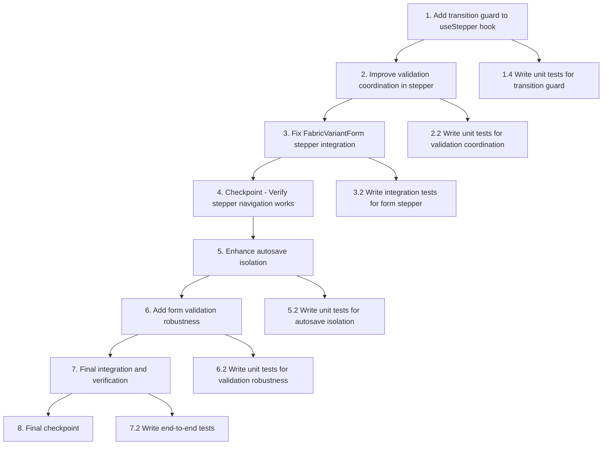

# Implementation Plan: FabricVariantForm Stepper Bug Fix

## Overview

This implementation fixes the critical stepper navigation bug in FabricVariantForm where clicking "Tiếp tục" (Continue) fails to advance from step 1 to step 2 in edit mode. The fix involves adding transition guards, improving state isolation, and ensuring proper coordination between the stepper and validation systems.

## Task Dependency Graph

```json
{
  "waves": [
    {
      "name": "Wave 1: Core Stepper Fix",
      "tasks": ["1.1", "1.2", "1.3"],
      "description": "Essential stepper transition guard implementation"
    },
    {
      "name": "Wave 2: Validation Enhancement",
      "tasks": ["2.1"],
      "description": "Improve validation coordination and timing",
      "dependsOn": ["Wave 1"]
    },
    {
      "name": "Wave 3: Form Integration",
      "tasks": ["3.1"],
      "description": "Integrate enhanced stepper with FabricVariantForm",
      "dependsOn": ["Wave 2"]
    },
    {
      "name": "Wave 4: Critical Path Verification",
      "tasks": ["4"],
      "description": "Checkpoint to verify core bug fix works",
      "dependsOn": ["Wave 3"]
    },
    {
      "name": "Wave 5: Defensive Improvements",
      "tasks": ["5.1", "6.1", "7.1"],
      "description": "Additional robustness and validation improvements",
      "dependsOn": ["Wave 4"]
    },
    {
      "name": "Wave 6: Final Verification",
      "tasks": ["8"],
      "description": "Final testing and verification",
      "dependsOn": ["Wave 5"]
    }
  ],
  "optionalTasks": ["1.4", "2.2", "3.2", "5.2", "6.2", "7.2"],
  "criticalPath": ["1.1", "1.2", "1.3", "2.1", "3.1", "4"],
  "notes": [
    "Tasks 1.1-1.3 must be completed in sequence",
    "Wave 1 is the minimum viable fix for the stepper bug",
    "Waves 5-6 provide additional robustness but are not required for basic functionality",
    "Optional tasks (marked with *) can be executed independently"
  ]
}
```



**Critical Path**: Tasks 1 → 2 → 3 → 4 are the minimum viable fix for the stepper bug. Tasks 5-8 provide additional robustness and defensive improvements.

**Independent Branches**: All test tasks (marked with \*) can be executed independently and in parallel with their corresponding implementation tasks.

## Tasks

- [ ] 1. Add transition guard to useStepper hook
  - [x] 1.1 Locate and analyze the current useStepper hook implementation
    - Find the useStepper hook file (likely in src/hooks/ or src/components/)
    - Review current implementation of the `next()` function
    - Identify where step transitions are managed
    - _Requirements: 1.1, 1.4, 2.1_
  - [x] 1.2 Add isTransitioning state to useStepper hook
    - Add `const [isTransitioning, setIsTransitioning] = useState(false)` state
    - Include `isTransitioning` in the returned interface
    - Update TypeScript types if interface exists
    - _Requirements: 1.1, 1.4, 2.1_
  - [x] 1.3 Implement transition guard in next() function
    - Add early return if `isTransitioning` is true
    - Set `setIsTransitioning(true)` at start of transition
    - Set `setIsTransitioning(false)` after transition completes or fails
    - Wrap transition logic in try/finally to ensure flag is reset
    - _Requirements: 1.1, 1.4, 2.1_

- [ ]\* 1.4 Write unit tests for transition guard
  - Test prevention of concurrent step transitions with rapid clicking
  - Test transition state management (isTransitioning flag behavior)
  - Test proper cleanup of transition state on success/failure
  - _Requirements: 1.1, 1.4, 2.1_

- [x] 2. Improve validation coordination in stepper
  - [x] 2.1 Enhance step validation timing
    - Ensure validation completes fully before step advancement
    - Add validation state tracking to prevent timing conflicts
    - Implement proper async/await handling in validation flow
    - _Requirements: 4.1, 4.4, 4.5_

  - [ ]\* 2.2 Write unit tests for validation coordination
    - Test validation completion before step advancement
    - Test validation failure scenarios
    - Test async validation timing
    - _Requirements: 4.1, 4.4, 4.5_

- [x] 3. Fix FabricVariantForm stepper integration
  - [x] 3.1 Update form component to use enhanced stepper
    - Integrate transition guard with existing stepper usage
    - Ensure proper error handling for validation failures
    - Maintain backward compatibility with existing form logic
    - _Requirements: 1.1, 1.2, 1.5, 2.1_

  - [ ]\* 3.2 Write integration tests for form stepper
    - Test step 1 to step 2 advancement in edit mode
    - Test step 1 to step 2 advancement in create mode
    - Test form state preservation during navigation
    - _Requirements: 1.1, 1.2, 1.5, 2.1_

- [x] 4. Checkpoint - Verify stepper navigation works
  - Ensure all tests pass, ask the user if questions arise.

- [ ] 5. Enhance autosave isolation (defensive)
  - [x] 5.1 Add stepper awareness to useFormAutoSave
    - Prevent autosave triggers during step transitions
    - Add optional stepper reference parameter
    - Ensure edit mode autosave remains disabled
    - _Requirements: 3.1, 3.2, 3.4, 3.5_

  - [ ]\* 5.2 Write unit tests for autosave isolation
    - Test autosave disabled in edit mode
    - Test no autosave during step transitions
    - Test autosave independence in create mode
    - _Requirements: 3.1, 3.2, 3.4, 3.5_

- [x] 6. Add form validation robustness
  - [x] 6.1 Strengthen step 1 validation implementation
    - Ensure all required fields are properly validated
    - Add field focus for validation failures
    - Improve validation error messaging
    - _Requirements: 4.1, 4.2, 4.3, 4.5_

  - [ ]\* 6.2 Write unit tests for validation robustness
    - Test validation of all required step 1 fields
    - Test validation error display
    - Test field focus on validation failure
    - _Requirements: 4.1, 4.2, 4.3, 4.5_

- [ ] 7. Final integration and verification
  - [ ] 7.1 Test complete form workflow
    - Verify step advancement works in both create and edit modes
    - Test back navigation functionality
    - Ensure form submission works after successful navigation
    - _Requirements: 1.1, 1.2, 2.1, 2.4_

  - [ ]\* 7.2 Write end-to-end tests
    - Test complete edit workflow from step 1 to submission
    - Test complete create workflow from step 1 to submission
    - Test error recovery scenarios
    - _Requirements: 1.1, 1.2, 2.1, 2.4_

- [~] 8. Final checkpoint - Ensure all tests pass
  - Ensure all tests pass, ask the user if questions arise.

## Notes

- Tasks marked with `*` are optional and can be skipped for faster bug resolution
- Each task references specific requirements for traceability
- Checkpoints ensure incremental validation and bug verification
- Focus on state isolation and timing coordination to prevent race conditions
- Maintain existing form functionality while fixing the stepper bug
