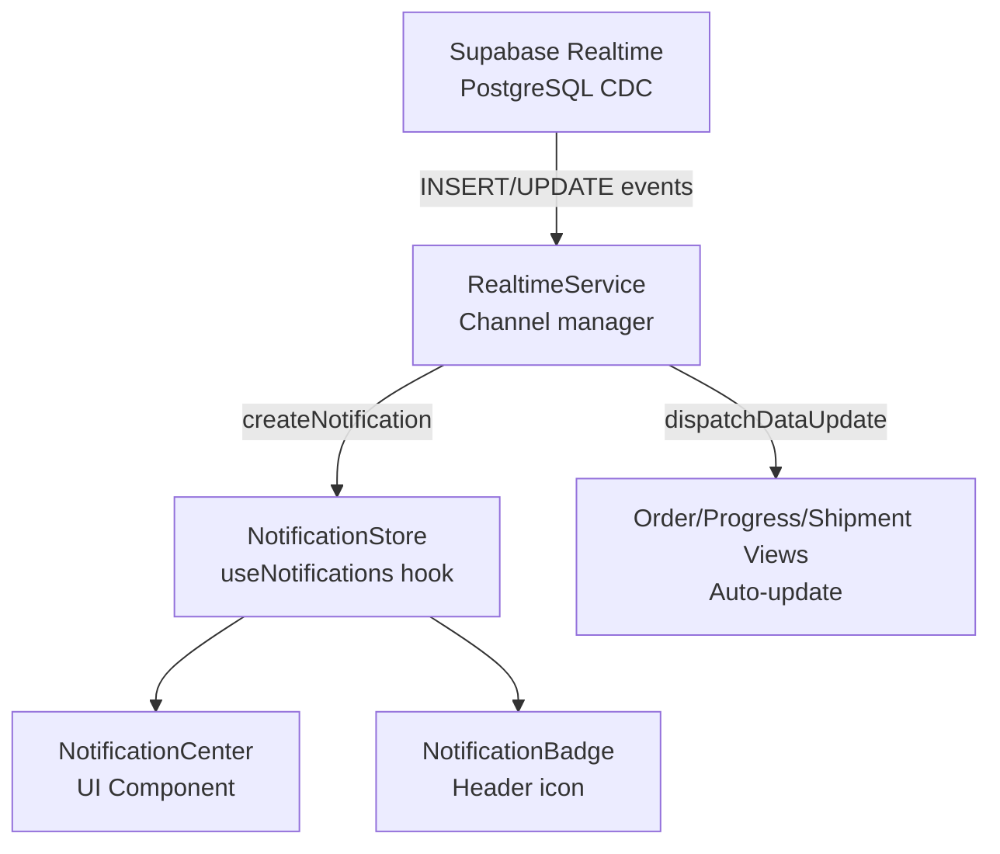
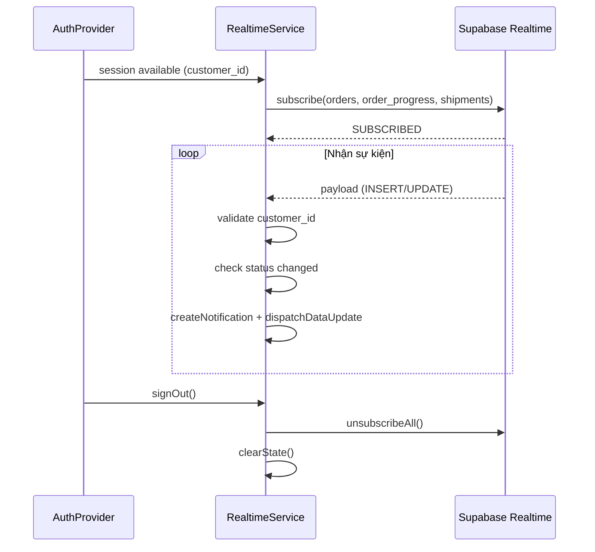
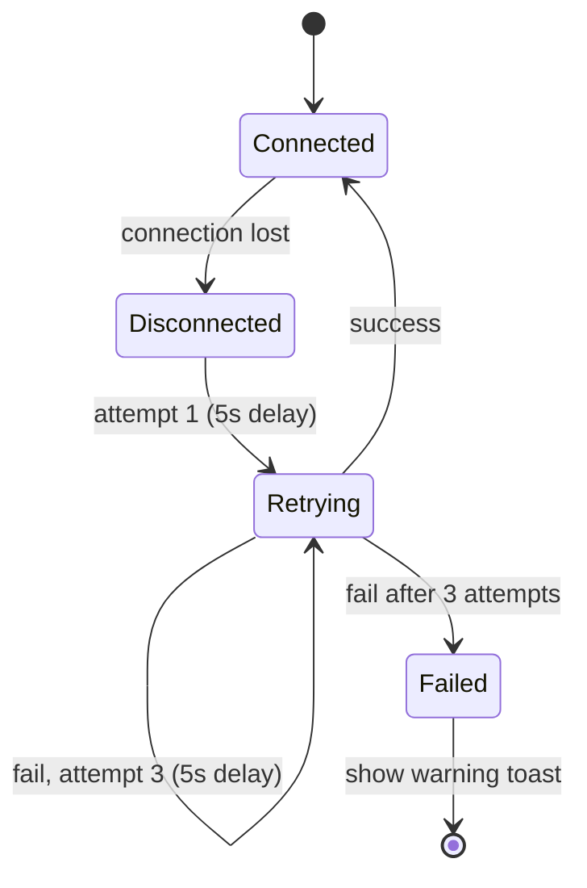

# Thiết Kế Kỹ Thuật: Thông Báo Realtime trong Customer Portal

## Overview

Tính năng bổ sung khả năng nhận thông báo realtime cho Customer Portal bằng cách tích hợp Supabase Realtime (PostgreSQL logical replication). Khi nhân viên nội bộ cập nhật trạng thái đơn hàng, tiến độ sản xuất hoặc tạo phiếu giao hàng mới, khách hàng nhận thông báo ngay lập tức mà không cần tải lại trang.

Thiết kế tập trung vào ba nguyên tắc:

- **Tách biệt rõ ràng**: `RealtimeService` quản lý kết nối Supabase, `NotificationStore` quản lý state, UI components chỉ đọc state.
- **Bảo mật theo chiều sâu**: Filter `customer_id` ở tầng Supabase channel + validation lại ở tầng application.
- **Tích hợp không xâm lấn**: Các hooks hiện có (`usePortalOrders`, `usePortalShipments`) được mở rộng để nhận realtime updates thông qua callback, không cần refactor.

---

## Architecture

### Luồng dữ liệu tổng quan



### Lifecycle kết nối



### Retry logic khi mất kết nối



---

## Components and Interfaces

### Cấu trúc thư mục mới

```
src/features/customer-portal/
  notifications/
    RealtimeService.ts          ← Quản lý Supabase channels
    useNotifications.ts         ← State store + hook
    NotificationCenter.tsx      ← Dropdown danh sách thông báo
    NotificationBadge.tsx       ← Icon chuông + badge số
    notificationMappers.ts      ← Enum → Vietnamese label
    types.ts                    ← NotificationItem, PortalEvent types
```

### RealtimeService

Module singleton quản lý toàn bộ vòng đời kết nối Supabase Realtime.

```typescript
interface RealtimeServiceConfig {
  customerId: string;
  orderIds: string[]; // để filter order_progress
  onNotification: (item: NotificationItem) => void;
  onDataUpdate: (event: PortalDataEvent) => void;
}

interface RealtimeService {
  start(config: RealtimeServiceConfig): void;
  stop(): void;
  isConnected(): boolean;
}
```

`start()` đăng ký 3 channels:

- `orders:customer_id=eq.{customerId}` — lắng nghe `UPDATE`
- `order_progress:order_id=in.(...)` — lắng nghe `INSERT`, `UPDATE`
- `shipments:customer_id=eq.{customerId}` — lắng nghe `INSERT`

`stop()` gọi `channel.unsubscribe()` cho tất cả channels và reset state.

### useNotifications hook

```typescript
interface NotificationItem {
  id: string;
  type: 'order_status' | 'order_progress' | 'shipment';
  title: string;
  body: string;
  orderId?: string;
  shipmentId?: string;
  createdAt: string; // ISO timestamp
  isRead: boolean;
}

interface NotificationState {
  items: NotificationItem[]; // max 50, sorted newest first
  unreadCount: number;
  connectionWarning: boolean; // true khi retry thất bại 3 lần
}

interface NotificationActions {
  addNotification: (item: NotificationItem) => void;
  markAllRead: () => void;
  clearAll: () => void;
  setConnectionWarning: (v: boolean) => void;
}

function useNotifications(): NotificationState & NotificationActions;
```

State được giữ trong React context (`NotificationProvider`), không persist vào localStorage.

### NotificationBadge

Hiển thị trong `CustomerPortalLayout` header, bên cạnh tên người dùng.

```typescript
// Props: none — đọc từ NotificationContext
function NotificationBadge(): JSX.Element;
// Render: icon chuông + badge số (ẩn khi unreadCount = 0)
// Click: toggle NotificationCenter dropdown
```

### NotificationCenter

Dropdown panel hiển thị danh sách thông báo.

```typescript
function NotificationCenter(): JSX.Element;
// - Hiển thị tối đa 50 items, scroll nếu nhiều hơn
// - Khi mở: gọi markAllRead()
// - Click item: navigate đến /portal/orders/:orderId
// - Empty state khi không có thông báo
```

### notificationMappers

Pure functions ánh xạ enum → tiếng Việt:

```typescript
function mapOrderStatus(status: OrderStatus): string;
// draft→"Nháp", confirmed→"Đã xác nhận", in_progress→"Đang sản xuất"
// completed→"Hoàn thành", cancelled→"Đã hủy"

function mapProductionStage(stage: ProductionStage): string;
// warping→"Mắc sợi", weaving→"Dệt", greige_check→"Kiểm vải mộc"
// dyeing→"Nhuộm", finishing→"Hoàn tất", final_check→"Kiểm tra cuối"
// packing→"Đóng gói"

function mapStageStatus(status: StageStatus): string;
// pending→"Chờ", in_progress→"Đang thực hiện", done→"Hoàn thành", skipped→"Bỏ qua"
```

### Tích hợp với hooks hiện có

Các hooks hiện có nhận thêm callback để xử lý realtime updates:

```typescript
// usePortalOrders — thêm updateOrderStatus và updateProgressStage
function usePortalOrders(orderId?: string): {
  // ... existing fields
  updateOrderStatus: (orderId: string, newStatus: OrderStatus) => void;
  updateProgressStage: (stageId: string, newStatus: StageStatus) => void;
};

// usePortalShipments — thêm prependShipment
function usePortalShipments(shipmentId?: string): {
  // ... existing fields
  prependShipment: (shipment: PortalShipment) => void;
};
```

`RealtimeService` gọi `onDataUpdate` với `PortalDataEvent`, và `CustomerPortalLayout` (hoặc `NotificationProvider`) dispatch event đến đúng hook đang active.

### Tích hợp vào CustomerPortalLayout

```typescript
// CustomerPortalLayout wrap thêm NotificationProvider
// và khởi động RealtimeService sau khi có session
function CustomerPortalLayout() {
  const { profile } = useAuth();
  // ...existing code...
  // Thêm: <NotificationProvider customerId={profile.customer_id} />
  // Thêm: <NotificationBadge /> trong header
}
```

---

## Data Models

### NotificationItem

```typescript
interface NotificationItem {
  id: string; // crypto.randomUUID()
  type: 'order_status' | 'order_progress' | 'shipment';
  title: string; // tiêu đề hiển thị
  body: string; // nội dung chi tiết
  orderId?: string; // để navigate
  shipmentId?: string;
  createdAt: string; // ISO 8601
  isRead: boolean;
}
```

### PortalDataEvent

```typescript
type PortalDataEvent =
  | { type: 'order_status_changed'; orderId: string; newStatus: OrderStatus }
  | {
      type: 'progress_stage_updated';
      stageId: string;
      orderId: string;
      newStatus: StageStatus;
    }
  | { type: 'shipment_created'; shipment: PortalShipment };
```

### Supabase Realtime Payload (tham khảo)

```typescript
// Payload nhận từ Supabase channel
interface RealtimePayload<T> {
  eventType: 'INSERT' | 'UPDATE' | 'DELETE';
  new: T;
  old: Partial<T>;
  table: string;
  schema: string;
}
```

### Không có thay đổi database

Tính năng này hoàn toàn ở tầng frontend. Không cần migration SQL mới — RLS policies đã được thiết lập trong spec `customer-portal`. Supabase Realtime sử dụng logical replication đã được bật sẵn trên các bảng `orders`, `order_progress`, `shipments`.

---

## Correctness Properties

_A property is a characteristic or behavior that should hold true across all valid executions of a system — essentially, a formal statement about what the system should do. Properties serve as the bridge between human-readable specifications and machine-verifiable correctness guarantees._

### Property 1: Retry logic dừng đúng sau 3 lần thất bại

_For any_ số lần thất bại kết nối liên tiếp `n`, `RealtimeService` phải thực hiện đúng `min(n, 3)` lần retry và chỉ khi `n >= 3` thì mới chuyển sang trạng thái `Failed` và kích hoạt cảnh báo.

**Validates: Requirements 1.3, 1.4**

### Property 2: Deduplication — bỏ qua khi status không thay đổi

_For any_ Realtime payload (từ bảng `orders` hoặc `order_progress`) mà `new.status === old.status`, hàm xử lý sự kiện phải trả về `null` (không tạo `NotificationItem`).

**Validates: Requirements 2.3, 3.4**

### Property 3: Enum mapping trả về nhãn tiếng Việt không rỗng

_For any_ giá trị hợp lệ của `OrderStatus`, `ProductionStage`, hoặc `StageStatus`, các hàm `mapOrderStatus`, `mapProductionStage`, `mapStageStatus` phải trả về một chuỗi tiếng Việt không rỗng và không phải `undefined`.

**Validates: Requirements 2.2, 3.2, 3.3**

### Property 4: Tạo notification đúng từ order event

_For any_ Realtime payload hợp lệ từ bảng `orders` với `new.status !== old.status`, hàm `createOrderNotification(payload)` phải trả về `NotificationItem` có `title` chứa `order_number` và `body` chứa nhãn tiếng Việt của `new.status`.

**Validates: Requirements 2.1, 2.2**

### Property 5: Tạo notification đúng từ order_progress event

_For any_ Realtime payload hợp lệ từ bảng `order_progress` (INSERT hoặc UPDATE với status thay đổi), hàm `createProgressNotification(payload, orderNumber)` phải trả về `NotificationItem` có `title` chứa `order_number` và `body` chứa nhãn tiếng Việt của stage và status.

**Validates: Requirements 3.1, 3.2, 3.3**

### Property 6: Tạo notification đúng từ shipment event

_For any_ Realtime payload hợp lệ từ bảng `shipments` (INSERT), hàm `createShipmentNotification(payload)` phải trả về `NotificationItem` có `title` chứa `shipment_number` và `body` chứa `order_number` và `delivery_address`.

**Validates: Requirements 4.1**

### Property 7: Danh sách thông báo luôn sắp xếp mới nhất trước

_For any_ danh sách `NotificationItem[]`, sau khi gọi `addNotification(item)`, phần tử ở index 0 phải có `createdAt` lớn hơn hoặc bằng tất cả các phần tử còn lại.

**Validates: Requirements 5.1**

### Property 8: Badge count bằng số thông báo chưa đọc

_For any_ danh sách `NotificationItem[]` với các giá trị `isRead` bất kỳ, `unreadCount` phải bằng đúng số phần tử có `isRead === false`.

**Validates: Requirements 5.2**

### Property 9: Mark all read đặt tất cả isRead = true

_For any_ danh sách `NotificationItem[]` với trạng thái đọc bất kỳ, sau khi gọi `markAllRead()`, tất cả phần tử phải có `isRead === true` và `unreadCount === 0`.

**Validates: Requirements 5.3**

### Property 10: Giới hạn 50 thông báo — xóa cũ nhất khi vượt quá

_For any_ danh sách `NotificationItem[]` có `n >= 50` phần tử, sau khi gọi `addNotification(newItem)`, danh sách phải có đúng 50 phần tử, `newItem` phải ở index 0, và phần tử cũ nhất (index `n-1` trước đó) không còn trong danh sách.

**Validates: Requirements 5.5**

### Property 11: Security filter — bỏ qua payload của customer khác

_For any_ Realtime payload có `new.customer_id !== currentCustomerId`, hàm `processPayload(payload, currentCustomerId)` phải trả về `null` và không tạo `NotificationItem` hay `PortalDataEvent`.

**Validates: Requirements 7.3**

### Property 12: Prepend shipment mới vào đầu danh sách

_For any_ danh sách `PortalShipment[]` hiện tại, sau khi gọi `prependShipment(newShipment)`, `newShipment` phải xuất hiện ở index 0 và tất cả phần tử cũ vẫn còn trong danh sách theo đúng thứ tự.

**Validates: Requirements 6.3**

---

## Error Handling

| Tình huống                                               | Xử lý                                                                                 |
| -------------------------------------------------------- | ------------------------------------------------------------------------------------- |
| Kết nối Realtime thất bại lần 1-3                        | Retry sau 5 giây, không hiển thị gì cho user                                          |
| Kết nối thất bại sau 3 lần                               | `setConnectionWarning(true)` → hiển thị toast cảnh báo nhẹ trong header               |
| Payload có `customer_id` không khớp                      | Bỏ qua silently, không log ra console production                                      |
| Payload thiếu trường bắt buộc (`order_number`, `status`) | Bỏ qua notification, không crash                                                      |
| `order_progress` payload thiếu `order_number`            | Fetch `order_number` từ `orders` table bằng `order_id`, hoặc dùng fallback "đơn hàng" |
| User đăng xuất trong khi đang retry                      | `stop()` cancel retry timer và unsubscribe                                            |
| Supabase Realtime không được bật trên bảng               | Channels subscribe nhưng không nhận event — không ảnh hưởng đến chức năng đọc dữ liệu |

---

## Testing Strategy

### Unit Tests (example-based, Vitest)

- `notificationMappers`: kiểm tra từng giá trị enum → đúng nhãn tiếng Việt
- `RealtimeService.stop()`: mock channel, kiểm tra `unsubscribe()` được gọi
- `NotificationCenter`: khi mở, `markAllRead()` được gọi
- Navigation: click notification item → `navigate('/portal/orders/:id')` được gọi
- `NotificationProvider`: không lưu gì vào `localStorage` hay `sessionStorage`

### Property-Based Tests (Vitest + fast-check, tối thiểu 100 iterations mỗi property)

Dùng thư viện **fast-check** (TypeScript-native PBT library).

**Property 1 — Retry logic:**

```
// Feature: portal-realtime-notifications, Property 1: retry stops after 3 failures
fc.property(fc.integer({ min: 0, max: 10 }), (failCount) => {
  const retries = simulateRetry(failCount);
  return retries === Math.min(failCount, 3);
})
```

**Property 2 — Deduplication:**

```
// Feature: portal-realtime-notifications, Property 2: skip when status unchanged
fc.property(arbitraryOrderStatus(), (status) => {
  const payload = { new: { status }, old: { status } };
  return processOrderPayload(payload) === null;
})
```

**Property 3 — Enum mapping:**

```
// Feature: portal-realtime-notifications, Property 3: enum mapping returns non-empty Vietnamese string
fc.property(
  fc.oneof(arbitraryOrderStatus(), arbitraryProductionStage(), arbitraryStageStatus()),
  (enumValue) => {
    const label = mapEnumValue(enumValue);
    return typeof label === 'string' && label.length > 0;
  }
)
```

**Property 4 — Order notification creation:**

```
// Feature: portal-realtime-notifications, Property 4: order notification contains order_number and status label
fc.property(arbitraryOrderPayloadWithStatusChange(), (payload) => {
  const item = createOrderNotification(payload);
  return item !== null
    && item.title.includes(payload.new.order_number)
    && item.body.includes(mapOrderStatus(payload.new.status));
})
```

**Property 5 — Progress notification creation:**

```
// Feature: portal-realtime-notifications, Property 5: progress notification contains order_number and stage/status labels
fc.property(arbitraryProgressPayload(), fc.string({ minLength: 1 }), (payload, orderNumber) => {
  const item = createProgressNotification(payload, orderNumber);
  return item !== null
    && item.title.includes(orderNumber)
    && item.body.includes(mapProductionStage(payload.new.stage))
    && item.body.includes(mapStageStatus(payload.new.status));
})
```

**Property 6 — Shipment notification creation:**

```
// Feature: portal-realtime-notifications, Property 6: shipment notification contains shipment_number and order_number
fc.property(arbitraryShipmentPayload(), (payload) => {
  const item = createShipmentNotification(payload);
  return item !== null
    && item.title.includes(payload.new.shipment_number)
    && item.body.includes(payload.new.order_number ?? '');
})
```

**Property 7 — Sorting:**

```
// Feature: portal-realtime-notifications, Property 7: notifications sorted newest first
fc.property(fc.array(arbitraryNotificationItem(), { minLength: 1 }), (items) => {
  const sorted = sortNotifications(items);
  return sorted.every((item, i) =>
    i === 0 || new Date(sorted[i-1].createdAt) >= new Date(item.createdAt)
  );
})
```

**Property 8 — Badge count:**

```
// Feature: portal-realtime-notifications, Property 8: unreadCount equals count of unread items
fc.property(fc.array(arbitraryNotificationItem()), (items) => {
  const count = computeUnreadCount(items);
  return count === items.filter(i => !i.isRead).length;
})
```

**Property 9 — Mark all read:**

```
// Feature: portal-realtime-notifications, Property 9: markAllRead sets all isRead=true
fc.property(fc.array(arbitraryNotificationItem()), (items) => {
  const result = markAllRead(items);
  return result.every(i => i.isRead === true) && computeUnreadCount(result) === 0;
})
```

**Property 10 — Capacity limit:**

```
// Feature: portal-realtime-notifications, Property 10: list capped at 50, oldest removed
fc.property(
  fc.array(arbitraryNotificationItem(), { minLength: 50, maxLength: 100 }),
  arbitraryNotificationItem(),
  (items, newItem) => {
    const result = addWithCapacity(items, newItem, 50);
    return result.length === 50
      && result[0].id === newItem.id
      && !result.includes(items[items.length - 1]);
  }
)
```

**Property 11 — Security filter:**

```
// Feature: portal-realtime-notifications, Property 11: payloads with wrong customer_id are rejected
fc.property(
  arbitraryPayloadWithCustomerId(),
  fc.uuidV(4),
  (payload, currentCustomerId) => {
    fc.pre(payload.new.customer_id !== currentCustomerId);
    return processPayload(payload, currentCustomerId) === null;
  }
)
```

**Property 12 — Prepend shipment:**

```
// Feature: portal-realtime-notifications, Property 12: new shipment prepended at index 0
fc.property(
  fc.array(arbitraryPortalShipment()),
  arbitraryPortalShipment(),
  (existing, newShipment) => {
    const result = prependShipment(existing, newShipment);
    return result[0].id === newShipment.id
      && result.length === existing.length + 1
      && existing.every((s, i) => result[i + 1].id === s.id);
  }
)
```

### Integration Tests

- Đăng nhập với role `customer` → `RealtimeService` subscribe đúng 3 channels với filter `customer_id`
- Đăng xuất → tất cả channels được unsubscribe trước khi session bị xóa
- Simulate Supabase event → `NotificationCenter` hiển thị notification mới
