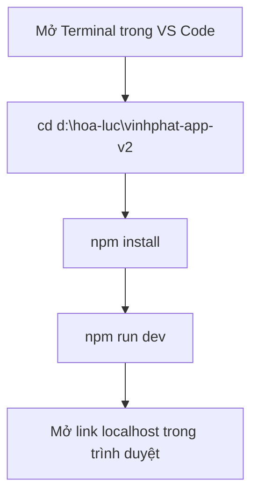
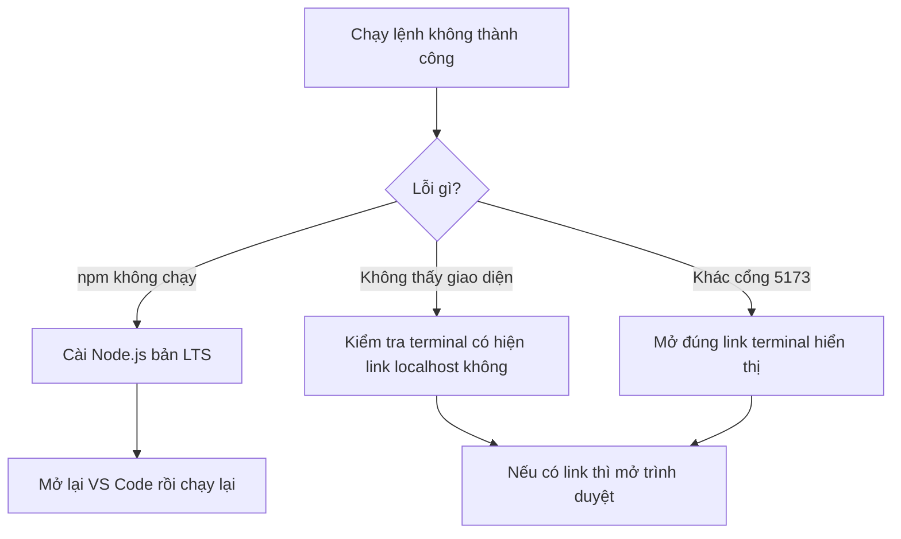
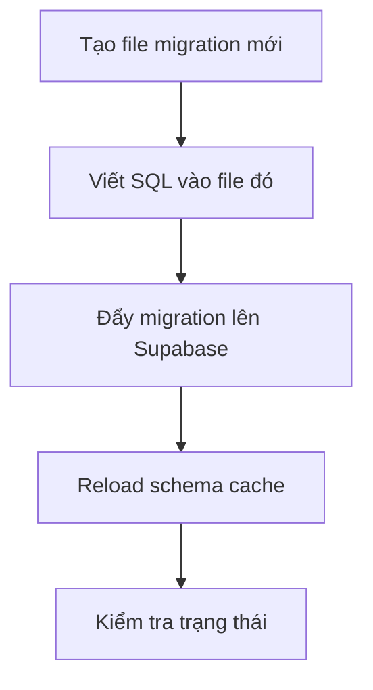

# Bắt đầu từ đây

## Mục tiêu

File này hướng dẫn cách mở giao diện dự án theo từng bước, dành cho người mới.

## Sơ đồ nhanh



## Bước 1: Mở Terminal trong VS Code

- Vào menu `Terminal` -> `New Terminal`
- Hoặc nhấn `Ctrl + Shift + \``

## Bước 2: Đi vào đúng thư mục dự án

Chạy lệnh này:

```powershell
cd d:\hoa-luc\vinhphat-app-v2
```

Ý nghĩa:

- Đưa terminal vào đúng thư mục chứa source code.

## Bước 3: Cài thư viện

Chạy lệnh này:

```powershell
npm install
```

Ý nghĩa:

- Cài các thư viện cần thiết để dự án có thể chạy.

Lưu ý:

- Lệnh này thường chỉ cần chạy lần đầu.

## Bước 4: Chạy dự án

Chạy lệnh này:

```powershell
npm run dev
```

Ý nghĩa:

- Khởi động server local để xem giao diện.

## Bước 5: Mở giao diện

Sau khi chạy xong, terminal sẽ hiện một link giống như:

```text
http://localhost:5173/
```

Việc cần làm:

- Giữ `Ctrl` và bấm vào link đó
- Hoặc copy link và dán vào trình duyệt

## Nếu đã chạy một lần rồi

Những lần sau bạn chỉ cần:

```powershell
cd d:\hoa-luc\vinhphat-app-v2
npm run dev
```

## Sơ đồ xử lý lỗi nhanh



## Nếu gặp lỗi

### Trường hợp 1: Không chạy được `npm`

Nguyên nhân:

- Máy chưa cài Node.js

Cách xử lý:

- Cài Node.js bản LTS
- Mở lại VS Code

### Trường hợp 2: Không thấy giao diện

Cách kiểm tra:

- Xem terminal có hiện link `localhost` hay không
- Nếu có, mở đúng link đó trong trình duyệt

### Trường hợp 3: Cổng không phải `5173`

Điều này bình thường.

- Vite có thể tự chuyển sang cổng khác như `5174`
- Hãy mở đúng link mà terminal hiển thị

## Tóm tắt nhanh

Chỉ cần nhớ 3 lệnh:

```powershell
cd d:\hoa-luc\vinhphat-app-v2
npm install
npm run dev
```

---

## Quản lý Database (Supabase)

Khi cần thay đổi cấu trúc database (thêm bảng, thêm cột, sửa schema…), dùng các lệnh dưới đây.

### Quy trình mỗi lần thay đổi database



### Bước 1: Tạo file migration mới

```powershell
npm run db:new ten_migration
```

Ý nghĩa:

- Tạo một file SQL mới trong thư mục `supabase/migrations/`.
- Thay `ten_migration` bằng tên mô tả thay đổi, ví dụ: `add_color_table`, `fix_order_field`.
- File được đánh số tự động theo thời gian, không cần đặt số thứ tự.

### Bước 2: Viết SQL vào file vừa tạo

- Mở file mới trong thư mục `supabase/migrations/`.
- Viết các lệnh SQL (CREATE TABLE, ALTER TABLE, v.v.).
- Lưu file.

### Bước 3: Đẩy migration lên Supabase

```powershell
npm run db:push
```

Ý nghĩa:

- Gửi tất cả migration chưa chạy lên database Supabase thật.
- Supabase tự biết migration nào đã chạy rồi, chỉ chạy cái mới.

### Bước 4: Reload schema cache

```powershell
npm run db:reload
```

Ý nghĩa:

- Sau khi thêm bảng hoặc cột mới, Supabase API chưa biết ngay.
- Lệnh này báo cho API cập nhật lại danh sách bảng/cột.
- Nếu không chạy, có thể gặp lỗi 404 khi gọi API đến bảng mới.

### Bước 5: Kiểm tra trạng thái

```powershell
npm run db:status
```

Ý nghĩa:

- Hiện danh sách tất cả migration và trạng thái (đã chạy hay chưa).
- Cột `Local` = file trên máy, cột `Remote` = đã áp dụng trên Supabase.
- Nếu Local = Remote ở tất cả dòng → mọi thứ đang đúng.

### Tóm tắt 4 lệnh database

| Lệnh                           | Ý nghĩa                           |
| ------------------------------ | --------------------------------- |
| `npm run db:new ten_migration` | Tạo file migration mới            |
| `npm run db:push`              | Đẩy migration lên Supabase thật   |
| `npm run db:reload`            | Cập nhật lại schema cache cho API |
| `npm run db:status`            | Kiểm tra migration đã chạy chưa   |
