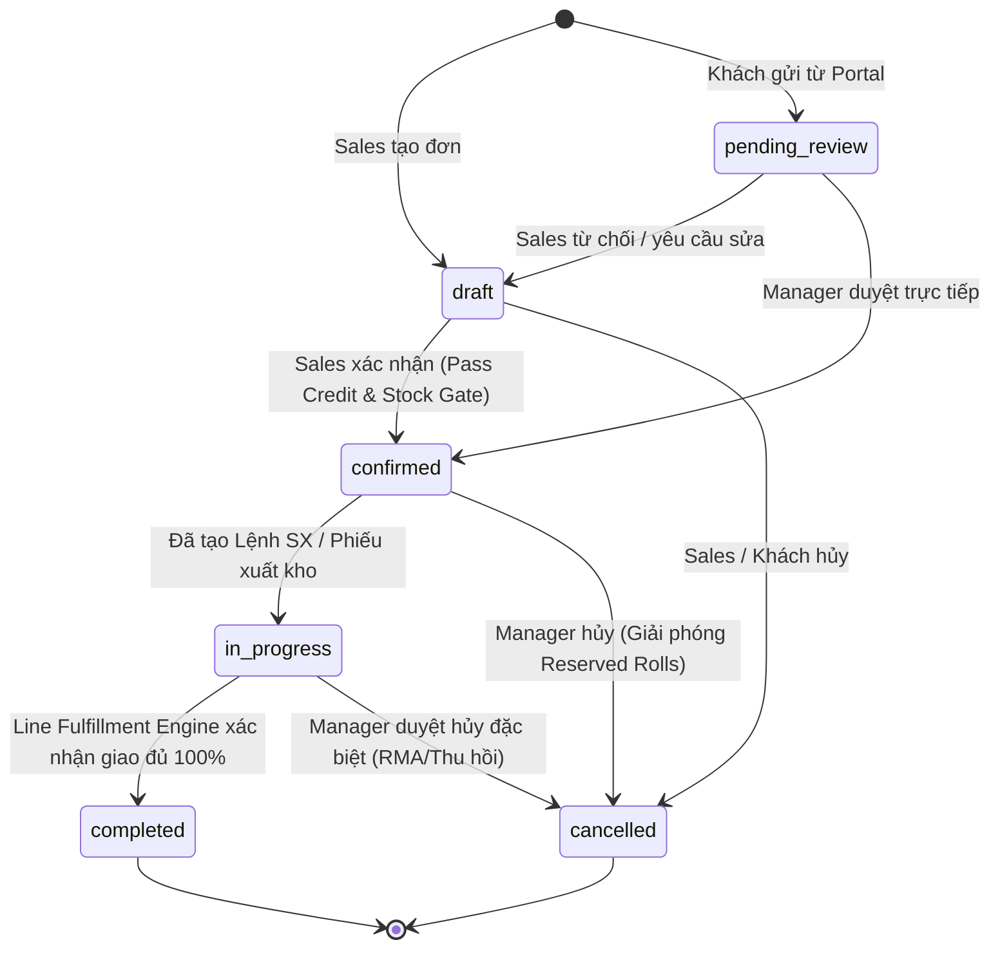
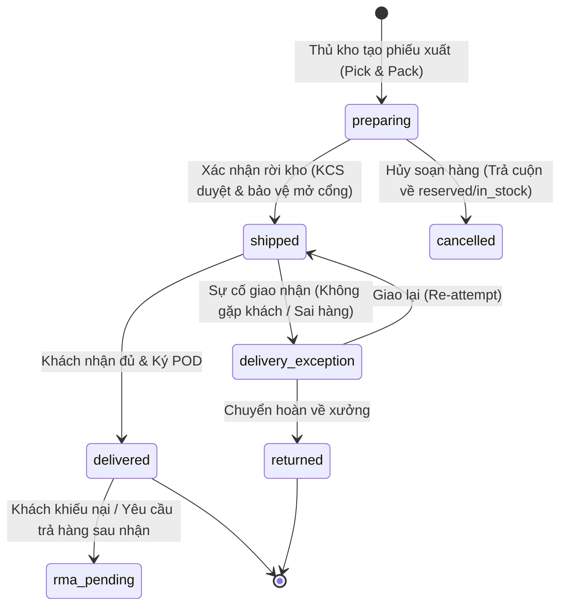

# 🛡️ ĐẶC TẢ KỸ THUẬT KIẾN TRÚC: ORDER → FULFILLMENT → SHIPMENT → DELIVERY

## STATE MACHINE, TRANSACTION & DATA ENGINE SPECIFICATION (SRS v3.0)

**Hệ thống:** VinhPhatERP v3 (Sản xuất Dệt Nhuộm & Phụ liệu Vĩnh Phát)  
**Tài liệu:** Technical Architecture & Database Transaction Specification  
**Mục tiêu:** Khóa cứng toàn bộ logic chuyển trạng thái, giao dịch nguyên tử (Atomic DB Transactions), động cơ xử lý đơn hàng theo dòng (Line-Item Fulfillment Engine), kho vận và hạch toán kế toán.  
**Đối tượng:** AI-Agent, Tech Lead, Backend & Database Engineers  
**Trạng thái:** PROPOSED ARCHITECTURE BASELINE

---

## 1. TỔNG QUAN & RANH GIỚI KIẾN TRÚC (BOUNDED CONTEXTS)

Hệ thống phân tách rạch ròi 4 miền nghiệp vụ độc lập, tương tác với nhau qua **Domain Events** và **Atomic RPCs**, tuyệt đối không truy cập hoặc cập nhật chéo trạng thái trực tiếp:

```text
┌────────────────┐      Domain Event       ┌────────────────────────┐
│  SALES / ORDER │ ─────────────────────>  │ INVENTORY / RESERVATION│
│ (Cam kết bán)  │   OrderConfirmedEvent   │  (Giữ cuộn / Trừ kho)  │
└───────┬────────┘                         └───────────┬────────────┘
        │                                              │
        │ Commercial Line                              │ Stock Issue
        ▼                                              ▼
┌────────────────────────┐                 ┌────────────────────────┐
│      LOGISTICS /       │  DeliveryEvent  │     FINANCE / AR       │
│  FULFILLMENT & TRIP    │ ─────────────>  │  (Hóa đơn & Công nợ)   │
│ (Phiếu xuất & Chuyến)  │                 │  (Hạch toán kế toán)   │
└────────────────────────┘                 └────────────────────────┘
```

### 4 Nguyên tắc Ranh giới Bắt buộc:

1. **Order Confirmation $\neq$ Ghi nhận Nợ:** Đơn hàng được duyệt (`confirmed`) là cam kết thương mại, **không được phép ghi tăng `current_debt` của khách hàng**. Công nợ chỉ phát sinh khi có chứng từ xuất kho hoặc hóa đơn tài chính (`INVOICE_POSTED` hoặc `STOCK_ISSUED`).
2. **Trừ kho tại thời điểm Xuất thực tế (Physical Stock Issue):** Trạng thái `shipped` của Shipment phải kích hoạt lệnh xuất kho trừ tồn thực tế qua RPC nguyên tử, không giao cho client cập nhật.
3. **Fulfillment theo Dòng hàng (Line-Item Fulfillment):** Đơn hàng chỉ hoàn thành (`completed`) khi từng dòng hàng (`order_items`) đã giao đủ hoặc đã được đóng dòng thiếu có xác nhận.
4. **Bằng chứng giao nhận (ePOD) Bất biến:** Ảnh biên nhận, chữ ký và tọa độ giao hàng sau khi submit sẽ được ghi vào bảng chứng từ bất biến, không cho phép xóa hay sửa đè.

---

## 2. MA TRẬN TRẠNG THÁI & PHÂN QUYỀN (STATE MACHINES & RBAC)

### 2.1. Order State Machine (Đơn hàng)



| Từ trạng thái            | Sang trạng thái | Điều kiện tiên quyết (Guard Condition)                                                                                     | Người có quyền (RBAC)             | Hành động hệ thống (System Action)                                                                                        |
| :----------------------- | :-------------- | :------------------------------------------------------------------------------------------------------------------------- | :-------------------------------- | :------------------------------------------------------------------------------------------------------------------------ |
| `draft`                  | `confirmed`     | Khách không bị `blocked`. Nếu nợ quá hạn hoặc vượt hạn mức thì phải có `manager_override`. Tồn kho khả dụng đủ để giữ chỗ. | `sales`, `manager`, `admin`       | Khóa cuộn vải (`reserved`). Sinh 7 công đoạn SX (nếu là `production`). Bắn `OrderConfirmedEvent`. **KHÔNG tăng công nợ**. |
| `confirmed`              | `in_progress`   | Ít nhất 1 Lệnh sản xuất (`work_order`) bắt đầu chạy HOẶC ít nhất 1 Phiếu xuất kho (`shipment`) chuyển sang `preparing`.    | `system`, `operator`, `warehouse` | Cập nhật tiến độ tổng quan.                                                                                               |
| `in_progress`            | `completed`     | Toàn bộ dòng hàng (`order_items`) có `fulfillment_status = 'fulfilled'` hoặc `'closed_shortage'`.                          | `system` (Line Engine), `manager` | Ghi nhận hoàn tất đơn hàng, khóa chỉnh sửa.                                                                               |
| Bất kỳ (trừ `completed`) | `cancelled`     | Không có phiếu xuất nào đang ở trạng thái `shipped` chưa giải quyết.                                                       | `manager`, `admin`                | Gọi `rpc_release_order_reservations` nhả cuộn về `in_stock`. Hủy các Work Orders liên quan.                               |

---

### 2.2. Shipment & Delivery State Machine (Phiếu xuất & Giao vận)



| Trạng thái  | Ý nghĩa nghiệp vụ                              | Trạng thái Cuộn vải (`finished_fabric_rolls`)             | Trạng thái Kế toán                                                         |
| :---------- | :--------------------------------------------- | :-------------------------------------------------------- | :------------------------------------------------------------------------- |
| `preparing` | Đang gom cuộn tại cửa xuất xưởng, in tem nhãn. | `reserved` (gắn với `shipment_id`)                        | Chưa phát sinh công nợ.                                                    |
| `shipped`   | Xe đã rời kho, hàng đang trên đường.           | **`shipped`** (Đã trừ tồn kho thực tế)                    | Phát sinh **Bút toán Nợ Kế toán (AR Ledger Entry)** hoặc Hóa đơn tạm tính. |
| `delivered` | Khách đã nhận hàng, có chữ ký/ảnh POD.         | `customer_held` (Đã chuyển giao rủi ro)                   | Kích hoạt kỳ hạn thanh toán (`due_date`).                                  |
| `returned`  | Hàng giao không thành công, xe chở về xưởng.   | Nhập vào **`quarantine` (Kho cách ly)** chờ KCS kiểm tra. | Hủy bút toán nợ phát sinh lúc xuất.                                        |

---

## 3. CƠ CHẾ KHÓA NGUYÊN TỬ (ATOMIC DB CONCURRENCY & RPCS)

Tuyệt đối cấm client frontend thực hiện các câu lệnh `supabase.from(...).update(...)` để thay đổi số lượng kho, công nợ hay trạng thái cuộn vải. Mọi thao tác đa bảng phải chạy qua các Database RPCs sau:

### 3.1. `rpc_create_order_atomic` (Sửa đổi: Bỏ cộng nợ tạm tính)

```sql
CREATE OR REPLACE FUNCTION rpc_create_order_atomic(
  p_order_number        TEXT,
  p_order_type          TEXT,
  p_customer_id         UUID,
  p_order_date          DATE,
  p_delivery_date       DATE,
  p_notes               TEXT,
  p_items               JSONB,
  p_allocations         JSONB,
  p_manager_override    BOOLEAN,
  p_override_user_id    UUID,
  p_source_quotation_id UUID,
  p_created_by          UUID
) RETURNS JSONB
LANGUAGE plpgsql
SECURITY DEFINER
AS $$
DECLARE
  v_order_id UUID;
  v_item JSONB;
  v_alloc JSONB;
  v_cust RECORD;
  v_total_amount NUMERIC(18,2) := 0;
BEGIN
  -- 1. Lock customer profile to check Credit Limit
  SELECT credit_limit, current_debt, overdue_debt, credit_status
  INTO v_cust
  FROM customers
  WHERE id = p_customer_id
  FOR UPDATE;

  IF NOT FOUND THEN
    RAISE EXCEPTION 'CUSTOMER_NOT_FOUND';
  END IF;

  IF v_cust.credit_status = 'blocked' THEN
    RAISE EXCEPTION 'CREDIT_BLOCKED: Khách hàng đang bị khóa giao dịch tín dụng.';
  END IF;

  -- 2. Tính tổng tiền đơn hàng
  FOR v_item IN SELECT * FROM jsonb_array_elements(p_items) LOOP
    v_total_amount := v_total_amount + ((v_item->>'quantity')::NUMERIC * (v_item->>'unit_price')::NUMERIC);
  END LOOP;

  -- 3. Kiểm tra hạn mức tín dụng (Gate validation)
  IF NOT p_manager_override THEN
    IF v_cust.overdue_debt > 0 THEN
      RAISE EXCEPTION 'OVERDUE_DEBT: Khách hàng đang có nợ quá hạn. Yêu cầu Quản lý phê duyệt (Override).';
    END IF;
    IF (v_cust.current_debt + v_total_amount) > v_cust.credit_limit THEN
      RAISE EXCEPTION 'CREDIT_LIMIT_EXCEEDED: Giá trị đơn hàng làm vượt hạn mức tín dụng. Yêu cầu Quản lý phê duyệt.';
    END IF;
  END IF;

  -- 4. Tạo Order Header
  INSERT INTO orders (
    order_number, order_type, customer_id, order_date, delivery_date,
    notes, total_amount, status, created_by, manager_override_by
  ) VALUES (
    p_order_number, p_order_type, p_customer_id, p_order_date, p_delivery_date,
    p_notes, v_total_amount, 'confirmed', p_created_by, p_override_user_id
  ) RETURNING id INTO v_order_id;

  -- 5. Tạo Order Items với chỉ số Line Fulfillment ban đầu
  FOR v_item IN SELECT * FROM jsonb_array_elements(p_items) LOOP
    INSERT INTO order_items (
      order_id, product_category, fabric_type, color_name, color_code,
      unit, quantity, unit_price, amount,
      ordered_qty, fulfilled_qty, returned_qty, cancelled_qty, fulfillment_status
    ) VALUES (
      v_order_id,
      COALESCE(v_item->>'productCategory', 'fabric'),
      v_item->>'fabricType',
      v_item->>'colorName',
      v_item->>'colorCode',
      v_item->>'unit',
      (v_item->>'quantity')::NUMERIC,
      (v_item->>'unitPrice')::NUMERIC,
      ((v_item->>'quantity')::NUMERIC * (v_item->>'unitPrice')::NUMERIC),
      (v_item->>'quantity')::NUMERIC, 0, 0, 0, 'unfulfilled'
    );
  END LOOP;

  -- 6. Giữ cuộn vải (Atomic Lock Reservation) nếu có danh sách chỉ định
  FOR v_alloc IN SELECT * FROM jsonb_array_elements(p_allocations) LOOP
    UPDATE finished_fabric_rolls
    SET status = 'reserved',
        reserved_for_order_id = v_order_id,
        updated_at = NOW()
    WHERE id = (v_alloc->>'rollId')::UUID
      AND status = 'in_stock';

    IF NOT FOUND THEN
      RAISE EXCEPTION 'CONCURRENT_ROLL_UNAVAILABLE: Cuộn % không còn ở trạng thái khả dụng.', v_alloc->>'rollId';
    END IF;
  END LOOP;

  -- ⚠️ QUY TẮC CỐT TỬ: TUYỆT ĐỐI KHÔNG TĂNG current_debt TẠI ĐÂY!
  -- Công nợ được hạch toán ở rpc_confirm_shipment_issue_stock

  -- 7. Audit log & Return
  INSERT INTO business_audit_log (event_type, entity_type, entity_id, user_id, payload)
  VALUES ('ORDER_CONFIRMED', 'order', v_order_id, p_created_by, jsonb_build_object(
    'order_number', p_order_number,
    'total_amount', v_total_amount,
    'override', p_manager_override
  ));

  RETURN jsonb_build_object('order_id', v_order_id, 'status', 'confirmed');
END;
$$;
```

---

### 3.2. `rpc_reserve_finished_rolls` (Giữ cuộn nguyên tử chống Race Condition)

```sql
CREATE OR REPLACE FUNCTION rpc_reserve_finished_rolls(
  p_order_id UUID,
  p_roll_ids UUID[]
) RETURNS VOID
LANGUAGE plpgsql
SECURITY DEFINER
AS $$
DECLARE
  v_locked_count INT;
BEGIN
  -- Sử dụng SELECT FOR UPDATE SKIP LOCKED để ngăn 2 Sales tranh chấp cùng 1 lúc
  SELECT COUNT(*)
  INTO v_locked_count
  FROM finished_fabric_rolls
  WHERE id = ANY(p_roll_ids)
    AND status = 'in_stock'
  FOR UPDATE;

  IF v_locked_count <> array_length(p_roll_ids, 1) THEN
    RAISE EXCEPTION 'ROLL_SELECTION_CONFLICT: Một hoặc nhiều cuộn vải đã bị giữ hoặc xuất bởi người khác.';
  END IF;

  UPDATE finished_fabric_rolls
  SET status = 'reserved',
      reserved_for_order_id = p_order_id,
      updated_at = NOW()
  WHERE id = ANY(p_roll_ids);
END;
$$;
```

---

### 3.3. `rpc_confirm_shipment_issue_stock` (Xuất kho & Hạch toán Nợ chính thức)

```sql
CREATE OR REPLACE FUNCTION rpc_confirm_shipment_issue_stock(
  p_shipment_id          UUID,
  p_expected_updated_at  TIMESTAMPTZ DEFAULT NULL
) RETURNS JSONB
LANGUAGE plpgsql
SECURITY DEFINER
AS $$
DECLARE
  v_shipment RECORD;
  v_roll_ids UUID[];
  v_order RECORD;
  v_shipment_value NUMERIC(18,2) := 0;
  v_item RECORD;
BEGIN
  -- 1. Lock shipment record (OCC check)
  SELECT * INTO v_shipment
  FROM shipments
  WHERE id = p_shipment_id
  FOR UPDATE;

  IF NOT FOUND THEN RAISE EXCEPTION 'SHIPMENT_NOT_FOUND'; END IF;
  IF v_shipment.status <> 'preparing' THEN
    RAISE EXCEPTION 'INVALID_SHIPMENT_STATUS: Phiếu xuất phải ở trạng thái preparing.';
  END IF;

  IF p_expected_updated_at IS NOT NULL AND
     date_trunc('milliseconds', v_shipment.updated_at) != date_trunc('milliseconds', p_expected_updated_at) THEN
    RAISE EXCEPTION 'OCC_MISMATCH: Dữ liệu phiếu xuất đã bị thay đổi bởi người khác.';
  END IF;

  -- 2. Trừ kho cuộn vải thực tế (reserved -> shipped)
  SELECT ARRAY_AGG(finished_roll_id)
  INTO v_roll_ids
  FROM shipment_items
  WHERE shipment_id = p_shipment_id AND finished_roll_id IS NOT NULL;

  IF v_roll_ids IS NOT NULL AND array_length(v_roll_ids, 1) > 0 THEN
    UPDATE finished_fabric_rolls
    SET status = 'shipped',
        reserved_for_order_id = NULL,
        shipped_at = NOW(),
        updated_at = NOW()
    WHERE id = ANY(v_roll_ids)
      AND status = 'reserved';

    IF NOT FOUND THEN
      RAISE EXCEPTION 'STOCK_ISSUE_FAIL: Một số cuộn vải không ở trạng thái reserved hợp lệ.';
    END IF;
  END IF;

  -- 3. Cập nhật trạng thái Shipment
  UPDATE shipments
  SET status = 'shipped',
      shipped_at = NOW(),
      updated_at = NOW()
  WHERE id = p_shipment_id;

  -- 4. Tính toán giá trị lô hàng xuất & Hạch toán công nợ Kế toán (AR Entry)
  SELECT o.id, o.customer_id, o.order_number INTO v_order
  FROM orders o WHERE o.id = v_shipment.order_id;

  -- Tính giá trị theo số lượng xuất thực tế trên phiếu
  SELECT COALESCE(SUM(si.quantity * oi.unit_price), 0)
  INTO v_shipment_value
  FROM shipment_items si
  JOIN order_items oi ON oi.order_id = v_shipment.order_id
                     AND oi.fabric_type = si.fabric_type
  WHERE si.shipment_id = p_shipment_id;

  -- Ghi nhận Nợ Kế toán (Tăng current_debt tại thời điểm xuất kho thực tế)
  IF v_shipment_value > 0 AND v_order.customer_id IS NOT NULL THEN
    UPDATE customers
    SET current_debt = current_debt + v_shipment_value,
        updated_at = NOW()
    WHERE id = v_order.customer_id;

    -- Ghi sổ nhật ký công nợ AR Ledger
    INSERT INTO customer_debt_ledger (
      customer_id, order_id, shipment_id, transaction_type,
      amount, reference_number, notes
    ) VALUES (
      v_order.customer_id, v_shipment.order_id, p_shipment_id, 'STOCK_ISSUE_DEBIT',
      v_shipment_value, v_shipment.shipment_number, 'Ghi nợ xuất kho lô hàng'
    );
  END IF;

  RETURN jsonb_build_object(
    'shipment_id', p_shipment_id,
    'status', 'shipped',
    'shipped_value', v_shipment_value,
    'rolls_deducted', array_length(v_roll_ids, 1)
  );
END;
$$;
```

---

## 4. ĐỘNG CƠ XỬ LÝ THEO DÒNG HÀNG (LINE-ITEM FULFILLMENT ENGINE)

Để giải quyết triệt để lỗi "tổng mét đủ nhưng sai mã vải", bảng `order_items` được quản trị trạng thái fulfillment độc lập.

### 4.1. Bảng cấu trúc `order_items` nâng cao

```sql
ALTER TABLE order_items
  ADD COLUMN IF NOT EXISTS ordered_qty       NUMERIC(14,2) NOT NULL DEFAULT 0,
  ADD COLUMN IF NOT EXISTS fulfilled_qty     NUMERIC(14,2) NOT NULL DEFAULT 0,
  ADD COLUMN IF NOT EXISTS returned_qty      NUMERIC(14,2) NOT NULL DEFAULT 0,
  ADD COLUMN IF NOT EXISTS cancelled_qty     NUMERIC(14,2) NOT NULL DEFAULT 0,
  ADD COLUMN IF NOT EXISTS fulfillment_status TEXT NOT NULL DEFAULT 'unfulfilled'
    CHECK (fulfillment_status IN ('unfulfilled', 'partially_fulfilled', 'fulfilled', 'closed_shortage'));
```

### 4.2. Logic Cập nhật Tiến độ sau khi Giao hàng Thành công (POD)

Khi một phiếu giao hàng hoàn tất (POD xác nhận), hệ thống kích hoạt hàm tính toán:

$$\text{effective\_fulfilled} = \text{fulfilled\_qty} - \text{returned\_qty}$$
$$\text{remaining\_qty} = \text{ordered\_qty} - \text{effective\_fulfilled} - \text{cancelled\_qty}$$

```text
Nếu remaining_qty <= 0        ──> fulfillment_status = 'fulfilled'
Nếu 0 < remaining_qty < order ──> fulfillment_status = 'partially_fulfilled'
Nếu chưa có lượt giao nào     ──> fulfillment_status = 'unfulfilled'
```

**Quy tắc đóng Đơn hàng tổng (`orders.status`):**
$$\text{Order Status} = \text{'completed'} \iff \forall \text{ item } \in \text{order\_items}: \text{item.fulfillment\_status} \in \{\text{'fulfilled'}, \text{'closed\_shortage'}\}$$

---

## 5. MÔ HÌNH CHUYẾN XE (DELIVERY TRIPS) & SA BÀN ĐIỀU PHỐI

Tách biệt hoàn toàn giữa **Chứng từ xuất kho (`shipments`)** và **Chuyến xe vận tải (`delivery_trips`)**.

```text
┌───────────────────────────────────────────────────────────────┐
│              DELIVERY TRIP (1 Chuyến xe tải 5T)               │
│  trip_number: 'TRIP-2026-0089' | vehicle_id | driver_id       │
└───────────────────────────────┬───────────────────────────────┘
                                │
        ┌───────────────────────┼───────────────────────┐
        ▼ Stop 1                ▼ Stop 2                ▼ Stop 3
┌──────────────────────┐┌──────────────────────┐┌──────────────────────┐
│ Shipment A (Khách 1) ││ Shipment B (Khách 2) ││ Shipment C (Khách 3) │
│ 20 cuộn Cotton       ││ 15 cuộn Khaki        ││ 30 cuộn Poly         │
│ Status: DELIVERED    ││ Status: DELIVERED    ││ Status: EXCEPTION    │
└──────────────────────┘└──────────────────────┘└──────────────────────┘
```

### 5.1. Bảng `delivery_trips` (Chuyến xe)

```sql
CREATE TABLE IF NOT EXISTS delivery_trips (
  id UUID PRIMARY KEY DEFAULT gen_random_uuid(),
  trip_number TEXT NOT NULL UNIQUE,
  driver_id UUID REFERENCES employees(id),
  vehicle_id UUID,
  vehicle_plate TEXT NOT NULL,
  max_payload_kg NUMERIC(10,2),
  planned_start_at TIMESTAMPTZ,
  actual_start_at TIMESTAMPTZ,
  completed_at TIMESTAMPTZ,
  status TEXT NOT NULL DEFAULT 'draft' CHECK (status IN ('draft', 'assigned', 'in_transit', 'completed', 'cancelled')),
  notes TEXT,
  created_at TIMESTAMPTZ NOT NULL DEFAULT NOW(),
  updated_at TIMESTAMPTZ NOT NULL DEFAULT NOW()
);
```

### 5.2. Bảng `delivery_trip_stops` (Các điểm dừng trên chuyến xe)

```sql
CREATE TABLE IF NOT EXISTS delivery_trip_stops (
  id UUID PRIMARY KEY DEFAULT gen_random_uuid(),
  trip_id UUID NOT NULL REFERENCES delivery_trips(id) ON DELETE CASCADE,
  shipment_id UUID NOT NULL REFERENCES shipments(id),
  stop_sequence INT NOT NULL, -- Thứ tự giao: 1, 2, 3...
  estimated_arrival TIMESTAMPTZ,
  actual_arrival TIMESTAMPTZ,
  stop_status TEXT NOT NULL DEFAULT 'pending' CHECK (stop_status IN ('pending', 'arrived', 'completed', 'failed', 'skipped')),
  failure_reason TEXT,
  created_at TIMESTAMPTZ NOT NULL DEFAULT NOW()
);
```

---

## 6. BẰNG CHỨNG GIAO HÀNG BẤT BIẾN (IMMUTABLE POD EVIDENCE LEDGER)

Bằng chứng giao hàng không được lưu dưới dạng trường text đơn thuần. Hệ thống lưu trữ dưới dạng bản ghi pháp lý bất biến.

```sql
CREATE TABLE IF NOT EXISTS delivery_proof_records (
  id UUID PRIMARY KEY DEFAULT gen_random_uuid(),
  shipment_id UUID NOT NULL REFERENCES shipments(id),
  trip_id UUID REFERENCES delivery_trips(id),
  receiver_name TEXT NOT NULL,
  receiver_phone TEXT,
  signature_image_url TEXT NOT NULL,
  evidence_photos TEXT[] NOT NULL DEFAULT '{}',
  geo_latitude NUMERIC(10, 7),
  geo_longitude NUMERIC(10, 7),
  device_info JSONB,
  captured_at TIMESTAMPTZ NOT NULL DEFAULT NOW(),
  hash_checksum TEXT NOT NULL, -- SHA-256(shipment_id + receiver_name + captured_at + signature_url)
  is_verified BOOLEAN NOT NULL DEFAULT true,
  created_by UUID REFERENCES auth.users(id)
);

-- RÀNG BUỘC BẢO VỆ: CẤM SỬA VÀ CẤM XÓA POD ĐÃ GHI NHẬN
CREATE OR REPLACE RULE no_update_pod AS ON UPDATE TO delivery_proof_records DO INSTEAD NOTHING;
CREATE OR REPLACE RULE no_delete_pod AS ON DELETE TO delivery_proof_records DO INSTEAD NOTHING;
```

---

## 7. CHU TRÌNH TRẢ HÀNG (RMA) & KHO CÁCH LY (QUARANTINE)

Tuyệt đối không chuyển trạng thái `shipped → in_stock` khi khách trả hàng. Toàn bộ hàng trả phải trải qua quy trình KCS:

```text
Khách trả hàng (Customer Return)
              │
              ▼
   [Tạo Phiếu RMA Request]
              │
              ▼
   [Nhập Kho Cách Ly (Quarantine)] ──> roll.status = 'quarantine'
              │
              ▼
    [KCS Kiểm định Chất lượng]
              │
      ┌───────┼────────────────────────┐
      ▼       ▼                        ▼
[Đạt Chuẩn] [Lỗi Màu / Dơ Biên]   [Lỗi Hư Hỏng Nặng]
      │       │                        │
      │       ▼                        ▼
      │   [Lệnh Nhuộm Lại/Giặt]   [Biên Bản Hủy Hàng]
      │   (Rework Work Order)     (Scrap / B-Grade)
      ▼
[Nhập lại Kho Bán] ──> roll.status = 'in_stock'
```

### Bảng dữ liệu RMA:

- `rma_requests`: Quản lý yêu cầu trả hàng, lý do, khách hàng, đơn hàng gốc.
- `rma_items`: Từng cuộn vải bị trả, số mét/kg thực tế nhận lại.
- `rma_inspections`: Kết quả kiểm tra của nhân viên QC/KCS và quyết định điều chuyển (`disposition_action`: `restock`, `rework`, `scrap`).
- **Hạch toán công nợ:** Công nợ của khách hàng chỉ được giảm trừ (Credit Memo) sau khi KCS duyệt biên bản RMA hoàn tất.

---

## 8. DANH MỤC DOMAIN EVENTS & TRANSACTION OUTBOX

Hệ thống sử dụng Outbox Pattern để đồng bộ bất đồng bộ nhưng tin cậy giữa các Bounded Context:

| Tên Event                  | Nguồn phát sinh      | Người tiêu thụ (Consumer)       | Tác động dữ liệu                                     |
| :------------------------- | :------------------- | :------------------------------ | :--------------------------------------------------- |
| `OrderConfirmedEvent`      | `Order`              | `Inventory`, `MES`              | Khóa giữ cuộn vải, khởi tạo kế hoạch nguyên liệu.    |
| `RollReservedEvent`        | `Inventory`          | `Order`                         | Cập nhật danh sách cuộn giữ trên đơn hàng.           |
| `StockIssuedEvent`         | `Shipment`           | `Inventory`, `Finance`          | Trừ kho cuộn vải vật lý, ghi nợ sơ bộ kế toán.       |
| `DeliveryPODCapturedEvent` | `Driver / Logistics` | `Fulfillment Engine`, `Finance` | Cập nhật Line-Item Fulfillment, kích hoạt kỳ hạn nợ. |
| `OrderLineFulfilledEvent`  | `Fulfillment Engine` | `Order`                         | Đánh giá điều kiện `Order.completed`.                |
| `RmaCompletedEvent`        | `QC / Warehouse`     | `Finance / AR`                  | Phát hành Credit Memo giảm công nợ khách hàng.       |

---

## 9. CHECKLIST BẢO VỆ CHO DEVELOPER & AI-AGENT (ACCEPTANCE CRITERIA)

Trước khi viết bất kỳ dòng mã nào liên quan đến Order & Shipment, kiểm tra 8 tiêu chí:

- [ ] **DB Rule 1:** Không có bất kỳ câu lệnh `UPDATE customers SET current_debt` nào nằm trong luồng tạo/xác nhận đơn hàng.
- [ ] **DB Rule 2:** Mọi thao tác reserve / unreserve cuộn vải bắt buộc bọc trong PostgreSQL RPC có khóa `FOR UPDATE`.
- [ ] **DB Rule 3:** Bảng `shipments` không còn đại diện cho chuyến xe tải (đã tách riêng `delivery_trips`).
- [ ] **DB Rule 4:** Trạng thái `orders.status = 'completed'` được suy dẫn từ 100% dòng hàng (`order_items.fulfillment_status`), không cộng gộp tổng mét toàn đơn.
- [ ] **DB Rule 5:** Bằng chứng giao nhận (ePOD) được lưu vào bảng `delivery_proof_records` và có cơ chế chống sửa/xóa.
- [ ] **DB Rule 6:** Hàng trả về xưởng bắt buộc vào trạng thái `quarantine`, cấm chuyển thẳng sang `in_stock`.
- [ ] **API Rule 7:** Các hàm mutation trên giao diện luôn truyền `expectedUpdatedAt` để thực thi OCC.
- [ ] **Testing Rule 8:** Có unit test mô phỏng 2 Sales cùng chốt 1 cuộn vải đồng thời (Concurrent Reservation Test) để bảo đảm 100% transaction rollback an toàn.
