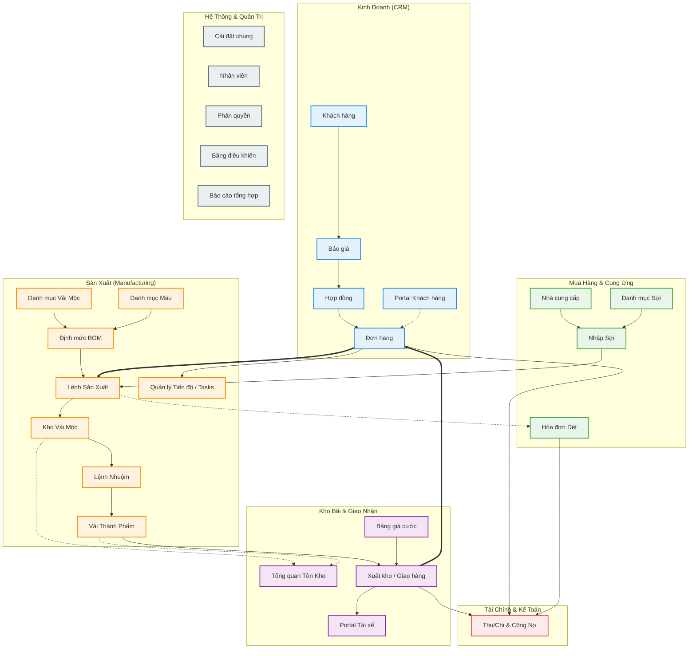

# Sơ đồ Module & Quan hệ - Vinh Phat ERP v3

Tài liệu này ánh xạ cấu trúc của 29 core modules trong hệ thống Vĩnh Phát ERP và cách dữ liệu luân chuyển giữa các mảng nghiệp vụ: Kinh doanh, Mua hàng, Sản xuất, Kho bãi, và Tài chính.

## 1. Sơ đồ Kiến trúc Tổng thể (Mermaid Flowchart)

## 2. Diễn giải Dòng chảy Dữ liệu (Data Flow)

### 2.1. Nhóm Kinh Doanh (Sales to Order)

Luồng khởi nguồn từ phân hệ Sales:

- **Khách hàng (`customers`)** yêu cầu **Báo giá (`quotations`)**.
- Báo giá được chốt sẽ chuyển thành **Hợp đồng (`contracts`)** và sinh ra **Đơn hàng (`orders`)**.
- Từ đây, nhu cầu được đẩy xuống nhà máy thông qua **Order Kanban** và **Operations** (theo dõi tiến độ).

### 2.2. Nhóm Sản xuất cốt lõi (Source to Make)

Vĩnh Phát là xưởng dệt nhuộm, quy trình sản xuất trải qua 2 giai đoạn chính:

- **Mộc (Greige):** Nguyên liệu đầu vào là **Sợi (`yarn-receipts`)**. Dựa trên **Định mức (`bom`)**, xưởng lên **Lệnh sản xuất (`work-orders`)** dệt sợi thành mộc. Sản phẩm nhập vào **Kho Mộc (`raw-fabric`)**. Gia công bên ngoài sẽ sinh ra **Hóa đơn dệt (`weaving-invoices`)**.
- **Nhuộm (Dyeing):** Từ Kho Mộc, hệ thống tạo **Lệnh nhuộm (`dyeing-orders`)** kèm theo **Màu sắc (`color-catalog`)**. Vải sau khi nhuộm được kiểm tra chất lượng và nhập vào **Kho Thành Phẩm (`finished-fabric`)**.

### 2.3. Nhóm Kho và Giao hàng (Make to Deliver)

- Vải thành phẩm sẽ được quét mã lô/cuộn để đưa lên xe **Giao hàng (`shipments`)**.
- Hệ thống tự động tính cước vận tải dựa trên **Bảng giá cước (`shipping-rates`)**.
- Tài xế thao tác nhận đơn và xác nhận giao qua **Driver Portal**.

### 2.4. Nhóm Tài chính (Order to Cash)

- Bất cứ giao dịch nào sinh ra dòng tiền hoặc công nợ đều đổ về **Payments**.
- Công nợ khách hàng tăng lên khi giao hàng (`shipments`), giảm xuống khi thu tiền (`payments`).
- Công nợ xưởng gia công tăng khi có phiếu dệt (`weaving-invoices`), giảm khi xuất chi (`payments`).

## 3. Cấu trúc Thư mục Tương ứng (`src/features`)

Danh sách 29 thư mục chính ánh xạ 1:1 với sơ đồ trên:

- **Sales:** `customers`, `quotations`, `contracts`, `orders`, `order-kanban`, `customer-portal`
- **Supply:** `suppliers`, `yarn-catalog`, `yarn-receipts`
- **Production:** `fabric-catalog`, `color-catalog`, `bom`, `work-orders`, `raw-fabric`, `dyeing-orders`, `finished-fabric`, `operations`, `weaving-invoices`
- **Logistics:** `inventory`, `shipments`, `shipping-rates`, `driver-portal`
- **Finance:** `payments`
- **System:** `auth`, `dashboard`, `employees`, `reports`, `settings`
